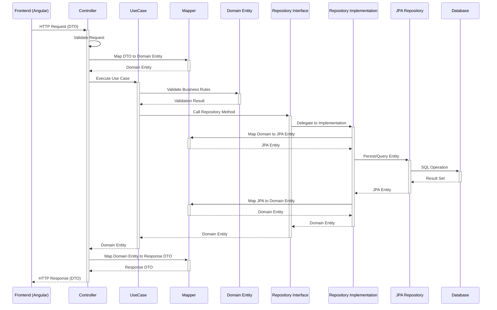
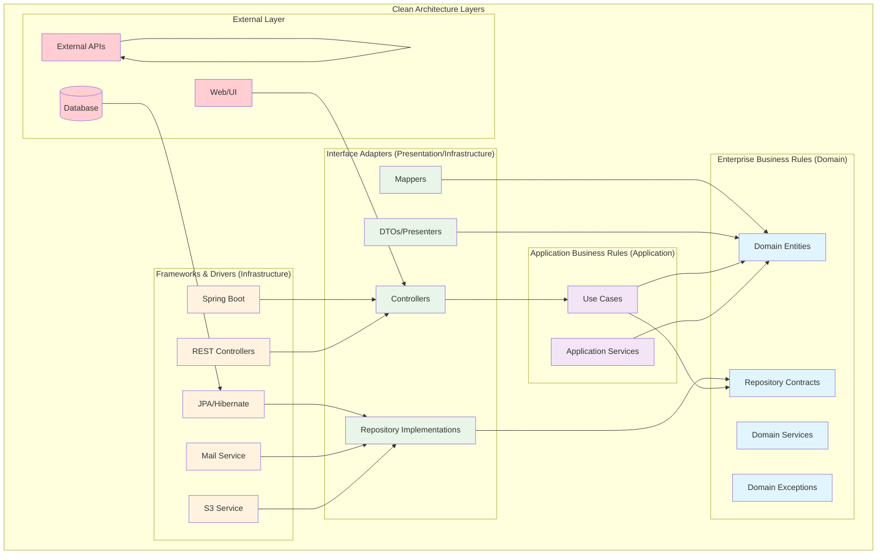

# Clean Architecture - BC Finances

## Visão Geral

O BC Finances foi migrado para uma arquitetura baseada nos princípios da **Clean Architecture** de Robert C. Martin (Uncle Bob). Esta arquitetura promove a separação de responsabilidades, independência de frameworks, testabilidade e manutenibilidade do código.

## Estrutura de Módulos

O projeto backend está organizado em módulos independentes, cada um seguindo a estrutura de camadas da Clean Architecture:

```
bc-finances-backend/src/main/java/br/com/bcfinances/
├── shared/           # Módulo compartilhado (cross-cutting concerns)
├── auth/            # Módulo de autenticação e autorização
├── category/        # Módulo de categorias
├── person/          # Módulo de pessoas/clientes
├── transaction/     # Módulo de transações financeiras
└── location/        # Módulo de localização (estados/cidades)
```

## Estrutura de Camadas por Módulo

Cada módulo business segue a mesma estrutura de camadas:

### 1. Domain (Camada de Domínio)
```
module/domain/
├── entities/        # Entidades de domínio (regras de negócio)
├── contracts/       # Contratos/interfaces de repositórios
└── exceptions/      # Exceções específicas do domínio
```

**Responsabilidades:**
- Definir as regras de negócio centrais
- Conter as entidades do domínio com suas validações
- Definir contratos para acesso a dados
- Não depender de nenhuma camada externa

**Exemplo - Category Entity:**
```java
public class Category {
    private Long id;
    private String name;
    
    public boolean isValid() {
        return name != null && name.trim().length() >= 3 && name.trim().length() <= 50;
    }
}
```

### 2. Application (Camada de Aplicação)
```
module/application/
├── usecases/        # Casos de uso (orquestração)
├── dto/            # DTOs de entrada e saída
└── mappers/        # Mapeadores entre entidades e DTOs
```

**Responsabilidades:**
- Orquestrar o fluxo de dados entre camadas
- Implementar casos de uso específicos
- Converter entre entidades de domínio e DTOs
- Validar dados de entrada

**Exemplo - CreateCategoryUseCase:**
```java
@Service
public class CreateCategoryUseCase {
    private final CategoryRepository categoryRepository;
    
    public Category execute(Category category) {
        if (!category.isValid()) {
            throw new IllegalArgumentException("Category name must be between 3 and 50 characters");
        }
        return categoryRepository.save(category);
    }
}
```

### 3. Infrastructure (Camada de Infraestrutura)
```
module/infrastructure/
├── persistence/     # Implementação de repositórios JPA
├── services/       # Implementações de serviços externos
└── config/         # Configurações específicas do módulo
```

**Responsabilidades:**
- Implementar os contratos definidos no domínio
- Gerenciar persistência de dados (JPA/Hibernate)
- Integrar com serviços externos
- Configurar dependências técnicas

**Exemplo - CategoryRepositoryImpl:**
```java
@Repository
public class CategoryRepositoryImpl implements CategoryRepository {
    private final CategoryJpaRepository jpaRepository;
    private final CategoryMapper mapper;
    
    @Override
    public Category save(Category category) {
        CategoryEntity entity = mapper.toEntity(category);
        CategoryEntity saved = jpaRepository.save(entity);
        return mapper.toDomain(saved);
    }
}
```

### 4. Presentation (Camada de Apresentação)
```
module/presentation/
├── controllers/     # Controllers REST
├── dto/            # DTOs específicos da API
└── security/       # Configurações de segurança por módulo
```

**Responsabilidades:**
- Expor APIs REST
- Validar dados de entrada via Bean Validation
- Gerenciar autenticação e autorização
- Tratar exceções e retornar respostas apropriadas

**Exemplo - CategoryController:**
```java
@RestController
@RequestMapping("/categories")
public class CategoryController {
    private final CreateCategoryUseCase createCategoryUseCase;
    
    @PostMapping
    @PreAuthorize("hasAuthority('ROLE_CREATE_CATEGORY')")
    public ResponseEntity<CategoryResponse> save(@Valid @RequestBody CategoryRequest request) {
        Category category = categoryMapper.toEntity(request);
        Category savedCategory = createCategoryUseCase.execute(category);
        return ResponseEntity.status(HttpStatus.CREATED).body(categoryMapper.toResponse(savedCategory));
    }
}
```

## Módulo Shared

O módulo `shared` contém funcionalidades transversais utilizadas por todos os outros módulos:

```
shared/
├── domain/          # Exceções base, value objects comuns
├── application/     # DTOs compartilhados, interfaces de serviços
├── infrastructure/  # Configurações globais, implementações compartilhadas
└── presentation/    # Exception handlers globais, controladores de saúde
```

**Funcionalidades principais:**
- Tratamento global de exceções (`BcFinancesExceptionHandler`)
- Configurações de infraestrutura (S3, Email, i18n)
- Eventos de sistema (`ResourceCreatedEvent`)
- Serviços utilitários (JWT, Mailer)

## Princípios Aplicados

### 1. Dependency Inversion Principle (DIP)
- Camadas internas não dependem de camadas externas
- Use de interfaces para desacoplar implementações
- Injeção de dependência via Spring

### 2. Single Responsibility Principle (SRP)
- Cada classe tem uma única responsabilidade bem definida
- Casos de uso específicos para cada operação
- Separação clara entre DTOs, entidades e mappers

### 3. Open/Closed Principle (OCP)
- Novas funcionalidades através de novos casos de uso
- Extensibilidade via interfaces e herança
- Configuração por convenção

### 4. Interface Segregation Principle (ISP)
- Interfaces específicas para cada responsabilidade
- Contratos pequenos e coesos
- Não forçar dependências desnecessárias

### 5. Liskov Substitution Principle (LSP)
- Implementações podem ser substituídas sem quebrar o sistema
- Hierarquias bem definidas
- Comportamento consistente entre implementações

## Fluxo de Dados

O fluxo típico de uma requisição segue o padrão:

```
Request → Controller → UseCase → Repository → Database
        ↓            ↓         ↓
     Validation → Business → Persistence
                 Rules
```

1. **Controller** recebe e valida a requisição
2. **UseCase** executa a lógica de negócio
3. **Repository** persiste/consulta dados
4. **Mapper** converte entre camadas
5. **Response** retorna resultado formatado

## Vantagens da Implementação

### ✅ Testabilidade
- Casos de uso isolados e facilmente testáveis
- Mocks simples através de interfaces
- Testes unitários independentes de infraestrutura

### ✅ Manutenibilidade
- Código organizado em camadas bem definidas
- Responsabilidades claras para cada classe
- Mudanças isoladas por módulo

### ✅ Flexibilidade
- Troca de implementações sem impacto no negócio
- Adição de novos módulos seguindo o mesmo padrão
- Evolução independente de cada camada

### ✅ Escalabilidade
- Módulos independentes podem ser extraídos para microserviços
- Possibilidade de equipes trabalharem em paralelo
- Deploy independente por módulo (futuramente)

## Padrões de Nomenclatura

### Entidades de Domínio
- Nome simples: `Category`, `Person`, `Transaction`
- Métodos de validação: `isValid()`, `canBeDeleted()`

### Casos de Uso
- Padrão: `<Action><Entity>UseCase`
- Exemplos: `CreateCategoryUseCase`, `FindPersonUseCase`

### Repositórios
- Interface: `<Entity>Repository`
- Implementação: `<Entity>RepositoryImpl`

### DTOs
- Request: `<Entity>Request`
- Response: `<Entity>Response`

### Controllers
- Padrão: `<Entity>Controller`
- Mapeamento: `/entities` (plural, lowercase)

## Migração Gradual

A migração para Clean Architecture foi feita de forma gradual:

1. **Fase 1**: Reestruturação de diretórios e separação de camadas
2. **Fase 2**: Criação de entidades de domínio e casos de uso
3. **Fase 3**: Implementação de repositórios e mappers
4. **Fase 4**: Refatoração de controllers e tratamento de exceções
5. **Fase 5**: Testes e ajustes finais

Esta abordagem permitiu manter a aplicação funcionando durante todo o processo de refatoração.

## Diagramas da Arquitetura

### Diagrama de Fluxo de Dados



### Diagrama de Dependências da Clean Architecture



## Legenda dos Diagramas

### Cores das Camadas
- 🔵 **Azul (Domain)**: Camada de domínio - regras de negócio centrais
- 🟣 **Roxo (Application)**: Camada de aplicação - casos de uso e orquestração
- 🟢 **Verde (Infrastructure)**: Camada de infraestrutura - detalhes técnicos
- 🔷 **Azul Claro (Presentation)**: Camada de apresentação - controllers e DTOs
- 🔴 **Vermelho (External)**: Sistemas externos

### Tipos de Setas
- **Setas sólidas (→)**: Dependências diretas
- **Setas pontilhadas (-.->)**: Implementações de interfaces
- **Setas bidirecionais (↔)**: Comunicação bidirecional