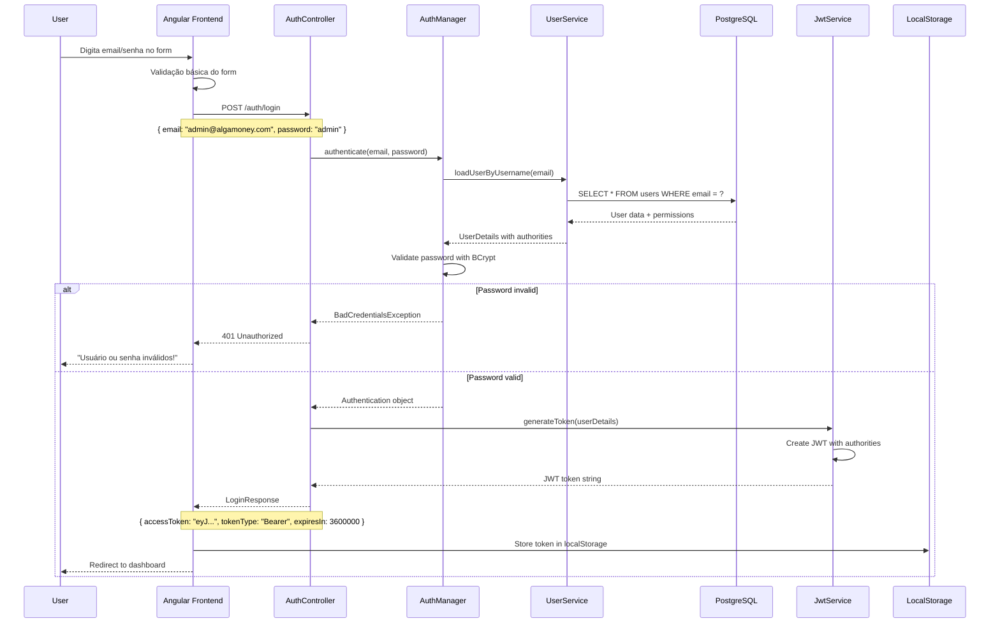
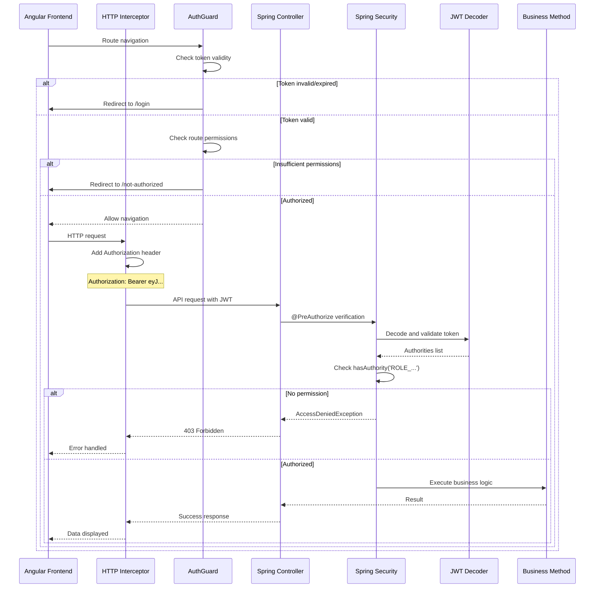
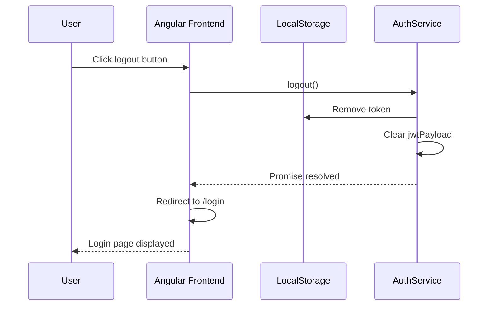

# Fluxo de Autenticação - BC Finances

## Visão Geral

Este documento descreve o fluxo completo de autenticação JWT no sistema BC Finances, desde o login do usuário até o acesso a recursos protegidos.

## Fluxo de Login



## Fluxo de Acesso a Recursos Protegidos



## Fluxo de Logout



## Detalhamento dos Componentes

### 1. AuthController (Backend)

```java
@PostMapping("/login")
public ResponseEntity<LoginResponse> login(@Valid @RequestBody LoginRequest loginRequest) {
    // 1. Autenticar usuário
    Authentication authentication = authenticationManager.authenticate(
        new UsernamePasswordAuthenticationToken(
            loginRequest.getEmail(),
            loginRequest.getPassword()
        )
    );

    // 2. Gerar JWT
    UserDetails userDetails = (UserDetails) authentication.getPrincipal();
    String token = jwtService.generateToken(userDetails);

    // 3. Retornar resposta
    LoginResponse response = new LoginResponse(token, "Bearer", jwtService.getExpirationTime());
    return ResponseEntity.ok(response);
}
```

### 2. AuthService (Frontend)

```typescript
login(email: string, password: string): Observable<any> {
    const body = { email, password };
    
    return this.httpClient.post(this.authLoginUrl, body, {headers})
        .pipe(
            tap((response: any) => this.storeToken(response.accessToken)),
            catchError(exception => {
                if (exception.status === 401) {
                    return throwError('Usuário ou senha inválidos!');
                }
                return throwError(exception);
            })
        );
}
```

### 3. AuthGuard (Frontend)

```typescript
canActivate(route: ActivatedRouteSnapshot): boolean {
    // Verificar token válido
    if (this.auth.isAccessTokenInvalid()) {
        this.router.navigate(['/login']);
        return false;
    }
    
    // Verificar permissões da rota
    if (route.data.roles && !this.auth.hasAnyPermission(route.data.roles)) {
        this.router.navigate(['/not-authorized']);
        return false;
    }
    
    return true;
}
```

### 4. Spring Security Configuration

```java
@Bean
public SecurityFilterChain filterChain(HttpSecurity http) throws Exception {
    return http
        .authorizeHttpRequests(auth -> auth
            .requestMatchers("/auth/login").permitAll()
            .anyRequest().authenticated()
        )
        .oauth2ResourceServer(oauth2 -> oauth2.jwt(withDefaults()))
        .sessionManagement(session -> 
            session.sessionCreationPolicy(SessionCreationPolicy.STATELESS)
        )
        .build();
}
```

## Estados do Token

### Token Válido
- ✅ Formato JWT correto (3 partes)
- ✅ Assinatura RS256 válida
- ✅ Não expirado (exp > now)
- ✅ Authorities presentes

### Token Inválido
- ❌ Formato incorreto
- ❌ Assinatura inválida
- ❌ Expirado
- ❌ Claims ausentes

## Tratamento de Erros

### Frontend
```typescript
// AuthService
catchError(exception => {
    if (exception.status === 401) {
        return throwError('Usuário ou senha inválidos!');
    }
    return throwError(exception);
})

// HTTP Interceptor
if (error.status === 401) {
    this.router.navigate(['/login']);
} else if (error.status === 403) {
    this.router.navigate(['/not-authorized']);
}
```

### Backend
```java
// Exception Handler
@ExceptionHandler(BadCredentialsException.class)
public ResponseEntity<String> handleBadCredentials(BadCredentialsException ex) {
    return ResponseEntity.status(HttpStatus.UNAUTHORIZED)
        .body("Credenciais inválidas");
}

@ExceptionHandler(AccessDeniedException.class)
public ResponseEntity<String> handleAccessDenied(AccessDeniedException ex) {
    return ResponseEntity.status(HttpStatus.FORBIDDEN)
        .body("Acesso negado");
}
```

## Segurança Implementada

### Proteções Backend
- ✅ CORS configurado
- ✅ CSRF desabilitado (stateless)
- ✅ JWT com assinatura RS256
- ✅ Passwords com BCrypt
- ✅ Session stateless

### Proteções Frontend
- ✅ Token no localStorage (HTTPS only em prod)
- ✅ Guards em todas as rotas protegidas
- ✅ Interceptação automática de 401/403
- ✅ Limpeza de token em logout