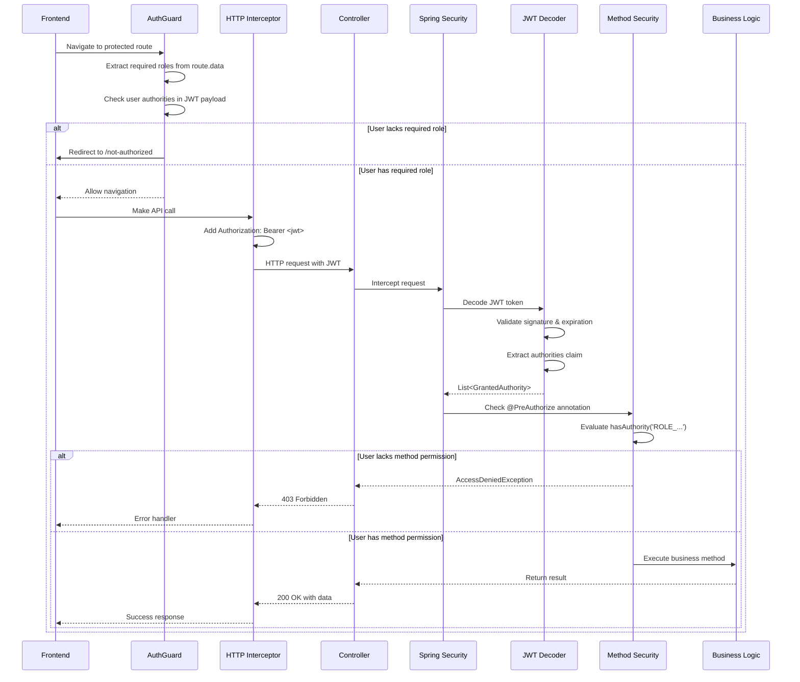
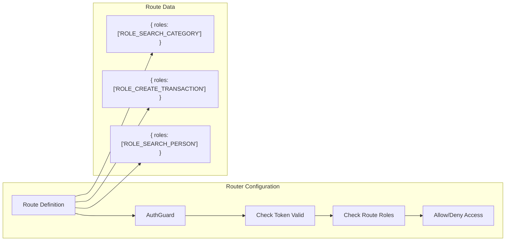
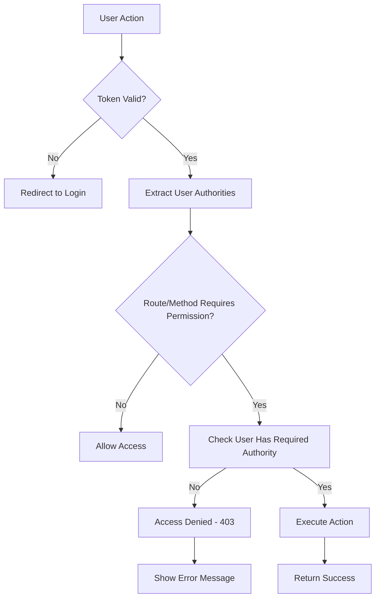

# Fluxo de Autorização - BC Finances

## Visão Geral

Este documento detalha como o sistema BC Finances implementa autorização baseada em roles através de JWT e Spring Security Method Security.

## Fluxo de Autorização Detalhado



## Mapeamento de Roles e Recursos

```mermaid
graph TB
    subgraph "Usuário Admin"
        U[admin@algamoney.com]
    end
    
    subgraph "Authorities no JWT"
        A1[ROLE_SEARCH_CATEGORY]
        A2[ROLE_CREATE_CATEGORY]
        A3[ROLE_SEARCH_PERSON]
        A4[ROLE_CREATE_PERSON]
        A5[ROLE_SEARCH_TRANSACTION]
        A6[ROLE_CREATE_TRANSACTION]
        A7[ROLE_REMOVE_TRANSACTION]
    end
    
    subgraph "Recursos Frontend"
        R1["/categories - Lista"]
        R2["/categories/new - Criar"]
        R3["/persons - Lista"]
        R4["/persons/new - Criar"]
        R5["/transactions - Lista"]
        R6["/transactions/new - Criar"]
        R7["Botão Excluir Transação"]
    end
    
    subgraph "Endpoints Backend"
        E1["GET /categories"]
        E2["POST /categories"]
        E3["GET /persons"]
        E4["POST /persons"]
        E5["GET /transactions"]
        E6["POST /transactions"]
        E7["DELETE /transactions/{id}"]
    end
    
    U --> A1
    U --> A2
    U --> A3
    U --> A4
    U --> A5
    U --> A6
    U --> A7
    
    A1 --> R1 --> E1
    A2 --> R2 --> E2
    A3 --> R3 --> E3
    A4 --> R4 --> E4
    A5 --> R5 --> E5
    A6 --> R6 --> E6
    A7 --> R7 --> E7
```

## Implementação de Autorização Frontend

### 1. Configuração de Rotas



### 2. Guards de Autorização

```typescript
// Exemplo de configuração de rota
{
  path: 'transactions',
  component: TransactionsComponent,
  canActivate: [AuthGuard],
  data: { roles: ['ROLE_SEARCH_TRANSACTION'] }
}

// AuthGuard - verificação de permissões
canActivate(route: ActivatedRouteSnapshot): boolean {
  const requiredRoles = route.data.roles;
  
  if (requiredRoles && !this.auth.hasAnyPermission(requiredRoles)) {
    this.router.navigate(['/not-authorized']);
    return false;
  }
  
  return true;
}
```

### 3. Controle Condicional de UI

```typescript
// Template HTML com controle de visibilidade
<button *ngIf="auth.hasPermission('ROLE_CREATE_TRANSACTION')" 
        class="btn btn-primary"
        routerLink="/transactions/new">
  Nova Transação
</button>

<div class="btn-group" *ngIf="auth.hasPermission('ROLE_REMOVE_TRANSACTION')">
  <button (click)="delete(transaction.id)" class="btn btn-danger">
    Excluir
  </button>
</div>
```

## Implementação de Autorização Backend

### 1. Method Security Configuration

```mermaid
graph TB
    subgraph "Spring Security Config"
        A[@EnableMethodSecurity] --> B[Method Interceptor]
        B --> C[@PreAuthorize Processor]
        C --> D[Authority Evaluation]
    end
    
    subgraph "JWT Processing"
        E[JWT Token] --> F[Extract Authorities]
        F --> G[SimpleGrantedAuthority]
        G --> D
    end
    
    subgraph "Method Annotations"
        H["@PreAuthorize('hasAuthority(ROLE_SEARCH_CATEGORY)')"]
        I["@PreAuthorize('hasAuthority(ROLE_CREATE_TRANSACTION)')"]
        J["@PreAuthorize('hasAuthority(ROLE_REMOVE_TRANSACTION)')"]
    end
    
    D --> H
    D --> I
    D --> J
```

### 2. Controller Security

```java
@RestController
@RequestMapping("/transactions")
public class TransactionController {
    
    @GetMapping
    @PreAuthorize("hasAuthority('ROLE_SEARCH_TRANSACTION')")
    public Page<Transaction> search(TransactionFilter filter, Pageable pageable) {
        return transactionService.search(filter, pageable);
    }
    
    @PostMapping
    @PreAuthorize("hasAuthority('ROLE_CREATE_TRANSACTION')")
    public ResponseEntity<Transaction> create(@Valid @RequestBody Transaction transaction) {
        Transaction saved = transactionService.save(transaction);
        return ResponseEntity.status(HttpStatus.CREATED).body(saved);
    }
    
    @DeleteMapping("/{id}")
    @PreAuthorize("hasAuthority('ROLE_REMOVE_TRANSACTION')")
    public ResponseEntity<Void> remove(@PathVariable Long id) {
        transactionService.delete(id);
        return ResponseEntity.noContent().build();
    }
}
```

### 3. JWT Authorities Converter

```java
@Bean
public JwtAuthenticationConverter jwtAuthenticationConverter() {
    JwtAuthenticationConverter converter = new JwtAuthenticationConverter();
    converter.setJwtGrantedAuthoritiesConverter(jwt -> {
        Collection<String> authorities = jwt.getClaimAsStringList("authorities");
        return authorities.stream()
            .map(SimpleGrantedAuthority::new)
            .collect(Collectors.toList());
    });
    return converter;
}
```

## Matriz de Permissões

| Resource | Search | Create | Update | Delete |
|----------|--------|--------|--------|--------|
| **Categories** | ROLE_SEARCH_CATEGORY | ROLE_CREATE_CATEGORY | - | - |
| **Persons** | ROLE_SEARCH_PERSON | ROLE_CREATE_PERSON | - | - |
| **Transactions** | ROLE_SEARCH_TRANSACTION | ROLE_CREATE_TRANSACTION | - | ROLE_REMOVE_TRANSACTION |

## Estrutura do JWT com Authorities

```json
{
  "sub": "admin@algamoney.com",
  "authorities": [
    "ROLE_SEARCH_CATEGORY",
    "ROLE_CREATE_CATEGORY",
    "ROLE_SEARCH_PERSON",
    "ROLE_CREATE_PERSON",
    "ROLE_SEARCH_TRANSACTION",
    "ROLE_CREATE_TRANSACTION",
    "ROLE_REMOVE_TRANSACTION"
  ],
  "iat": 1692792000,
  "exp": 1692795600
}
```

## Fluxo de Verificação de Permissões



## Cenários de Autorização

### 1. Sucesso - Usuário com Permissão
```
User: admin@algamoney.com
Authority: ROLE_SEARCH_TRANSACTION
Action: GET /transactions
Result: ✅ 200 OK - Lista de transações
```

### 2. Falha - Usuário sem Permissão
```
User: user@example.com  
Authority: ROLE_SEARCH_CATEGORY (apenas)
Action: POST /transactions
Result: ❌ 403 Forbidden - Access Denied
```

### 3. Falha - Token Inválido
```
User: Qualquer
Token: Expirado/Inválido
Action: Qualquer endpoint protegido
Result: ❌ 401 Unauthorized - Token inválido
```

## Tratamento de Exceções

### Backend Exception Handler
```java
@ExceptionHandler(AccessDeniedException.class)
public ResponseEntity<ErrorResponse> handleAccessDenied(AccessDeniedException ex) {
    ErrorResponse error = new ErrorResponse(
        "ACCESS_DENIED",
        "Usuário não possui permissão para acessar este recurso"
    );
    return ResponseEntity.status(HttpStatus.FORBIDDEN).body(error);
}
```

### Frontend Error Interceptor
```typescript
@Injectable()
export class ErrorInterceptor implements HttpInterceptor {
  intercept(req: HttpRequest<any>, next: HttpHandler): Observable<HttpEvent<any>> {
    return next.handle(req).pipe(
      catchError((error: HttpErrorResponse) => {
        if (error.status === 403) {
          // Mostrar modal ou redirecionar para página de erro
          this.notificationService.error('Acesso negado');
          this.router.navigate(['/not-authorized']);
        }
        return throwError(error);
      })
    );
  }
}
```

## Boas Práticas de Autorização

### 1. Princípio da Defesa em Profundidade
- ✅ Verificação no frontend (UX)
- ✅ Verificação no backend (Segurança)
- ✅ Validação no banco (Integridade)

### 2. Least Privilege
- ✅ Usuários recebem apenas permissões mínimas necessárias
- ✅ Permissões granulares por ação (search, create, remove)
- ✅ Sem permissões "super admin" desnecessárias

### 3. Fail Secure
- ✅ Default para "acesso negado"
- ✅ Verificação explícita de permissões
- ✅ Logs de tentativas de acesso negado