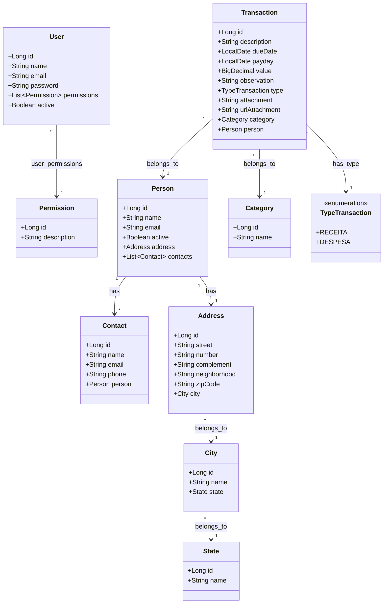

# Diagrama de Classes - BC Finances

## Visão Geral

Este diagrama representa a estrutura das principais entidades do sistema BC Finances e seus relacionamentos.

## Relacionamentos

### User ↔ Permission (N:N)
- Um usuário pode ter múltiplas permissões
- Uma permissão pode ser atribuída a múltiplos usuários
- Tabela de junção: `user_permissions`

### Person ↔ Contact (1:N)
- Uma pessoa pode ter múltiplos contatos
- Cada contato pertence a uma única pessoa

### Person ↔ Address (1:1)
- Uma pessoa possui um endereço
- Um endereço pertence a uma única pessoa

### Address ↔ City (N:1)
- Múltiplos endereços podem estar na mesma cidade
- Cada endereço pertence a uma única cidade

### City ↔ State (N:1)
- Múltiplas cidades podem estar no mesmo estado
- Cada cidade pertence a um único estado

### Transaction ↔ Category (N:1)
- Múltiplas transações podem ter a mesma categoria
- Cada transação pertence a uma única categoria

### Transaction ↔ Person (N:1)
- Múltiplas transações podem estar associadas à mesma pessoa
- Cada transação está associada a uma única pessoa

## Principais Características

### Entidade User
- **Autenticação**: Email e senha criptografada
- **Autorização**: Lista de permissões para controle de acesso
- **Status**: Campo `active` para ativar/desativar usuários

### Entidade Transaction
- **Tipos**: RECEITA ou DESPESA (enum TypeTransaction)
- **Datas**: Data de vencimento e data de pagamento
- **Anexos**: Suporte a upload de arquivos (attachment/urlAttachment)
- **Categorização**: Associação obrigatória com categoria

### Entidade Person
- **Contatos**: Múltiplos meios de contato por pessoa
- **Endereço**: Endereço completo com cidade e estado
- **Status**: Campo `active` para controle de pessoas ativas

### Hierarquia Geográfica
- **Estado → Cidade → Endereço**: Estrutura hierárquica para localização
- **Normalização**: Evita duplicação de dados geográficos