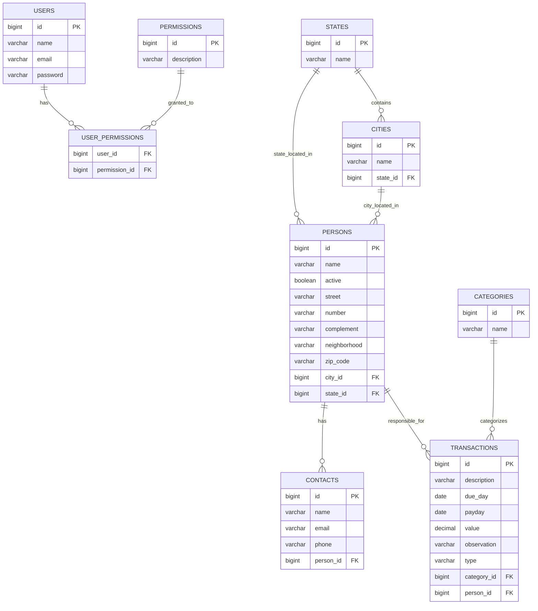

# Diagrama Entidade-Relacionamento - BC Finances

## Modelo de Dados

Este diagrama representa a estrutura do banco de dados PostgreSQL do sistema BC Finances.



## Tabelas do Sistema

### Autenticação e Autorização

#### USERS
- **Chave Primária**: `id` (BIGSERIAL)
- **Únicos**: `email` (índice único)
- **Campos Obrigatórios**: `name`, `email`, `password`
- **Controle**: `active` (boolean), timestamps de auditoria

#### PERMISSIONS
- **Chave Primária**: `id` (BIGSERIAL)
- **Únicos**: `description` (índice único)
- **Formato**: `ROLE_ACTION_RESOURCE` (ex: `ROLE_SEARCH_TRANSACTION`)

#### USER_PERMISSIONS
- **Chave Composta**: `user_id` + `permission_id`
- **Relacionamento**: N:N entre USERS e PERMISSIONS

### Dados Geográficos

#### STATES
- **Chave Primária**: `id` (BIGSERIAL)
- **Dados**: Estados brasileiros (SP, RJ, MG, etc.)

#### CITIES
- **Chave Primária**: `id` (BIGSERIAL)
- **Chave Estrangeira**: `state_id` → STATES(id)
- **Dados**: Cidades por estado

### Entidades de Negócio

#### PERSONS
- **Chave Primária**: `id` (BIGSERIAL)
- **Chaves Estrangeiras**: `city_id` → CITIES(id), `state_id` → STATES(id)
- **Endereço**: Embedded na própria tabela
- **Controle**: `active` (boolean)

#### CONTACTS  
- **Chave Primária**: `id` (BIGSERIAL)
- **Chave Estrangeira**: `person_id` → PERSONS(id)
- **Relacionamento**: 1:N (uma pessoa, múltiplos contatos)

#### CATEGORIES
- **Chave Primária**: `id` (BIGSERIAL)
- **Dados**: Categorias financeiras (Lazer, Alimentação, Farmácia, etc.)

#### TRANSACTIONS
- **Chave Primária**: `id` (BIGSERIAL)
- **Chaves Estrangeiras**: 
  - `category_id` → CATEGORIES(id)
  - `person_id` → PERSONS(id)
- **Tipos**: `type` VARCHAR ('RECEITA' ou 'DESPESA')
- **Valores**: `value` DECIMAL(10,2) para precisão decimal
- **Datas**: `due_day` (vencimento), `payday` (pagamento)

## Constraints Definidas nas Migrations

### Chaves Estrangeiras (Definidas no CREATE TABLE)
```sql
-- Em user_permissions
PRIMARY KEY (user_id, permission_id),
FOREIGN KEY (user_id) REFERENCES users (id),
FOREIGN KEY (permission_id) REFERENCES permissions (id)

-- Em transactions
CONSTRAINT fk_transactions_category FOREIGN KEY (category_id) REFERENCES categories(id),
CONSTRAINT fk_transactions_person FOREIGN KEY (person_id) REFERENCES persons(id)
```

## Dados Iniciais

### Usuários Iniciais
```sql
INSERT INTO users (name, email, password) VALUES 
('Administrador', 'admin@algamoney.com', '$2a$10$6v9JTwJNt1gngxGTy51ecON5Sx.m8aJ2HZPz.i2moVeP8.2oUAZAO'),
('Maria Silva', 'maria@algamoney.com', '$2a$10$gYakxlN5Ldbh5GbEjuq/WuxstGQBtIQ2U95q1jsa6mgQcyFyRXtOG');
```

### Permissões Padrão
```sql
INSERT INTO permissions (description) VALUES
('ROLE_CREATE_CATEGORY'),
('ROLE_SEARCH_CATEGORY'),
('ROLE_CREATE_PERSON'),
('ROLE_REMOVE_PERSON'),
('ROLE_SEARCH_PERSON'),
('ROLE_CREATE_TRANSACTION'),
('ROLE_REMOVE_TRANSACTION'),
('ROLE_SEARCH_TRANSACTION');
```

### Categorias Iniciais
```sql
INSERT INTO categories (name) VALUES 
('Lazer'),
('Alimentação'),
('Supermecado'),
('Farmácia'),
('Outros');
```