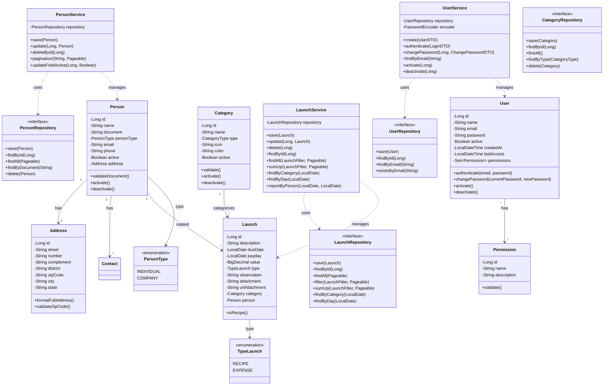
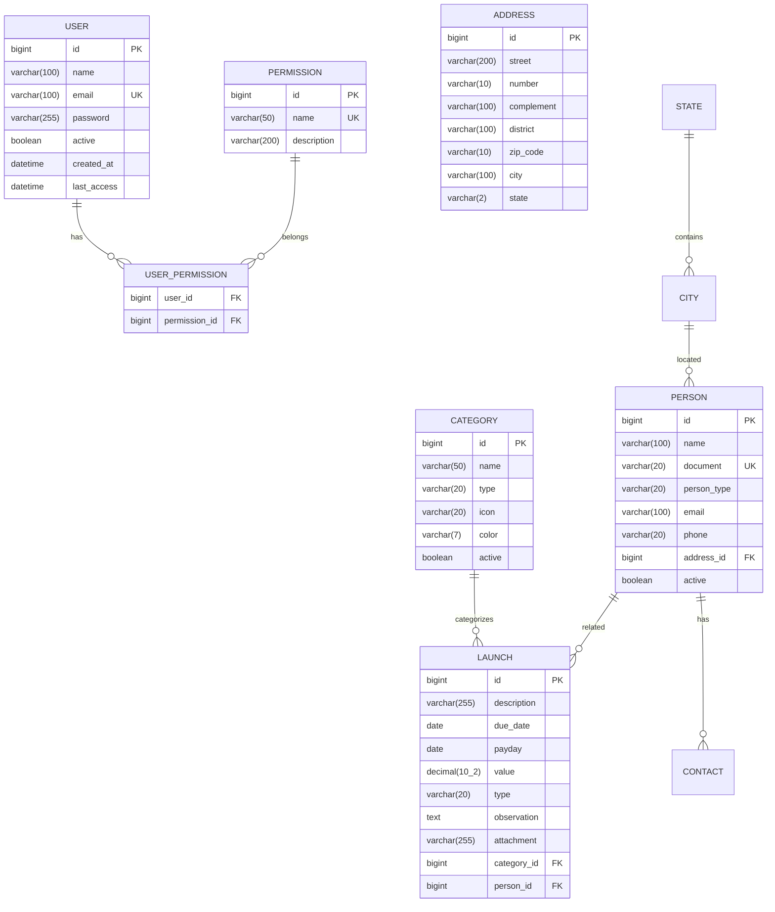
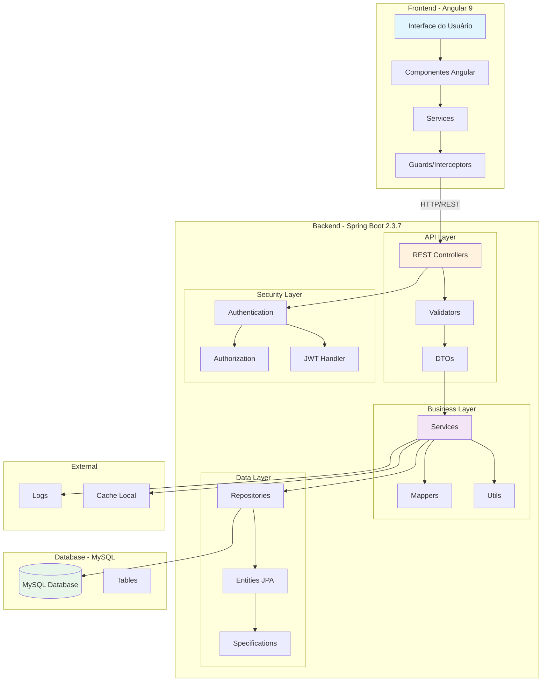
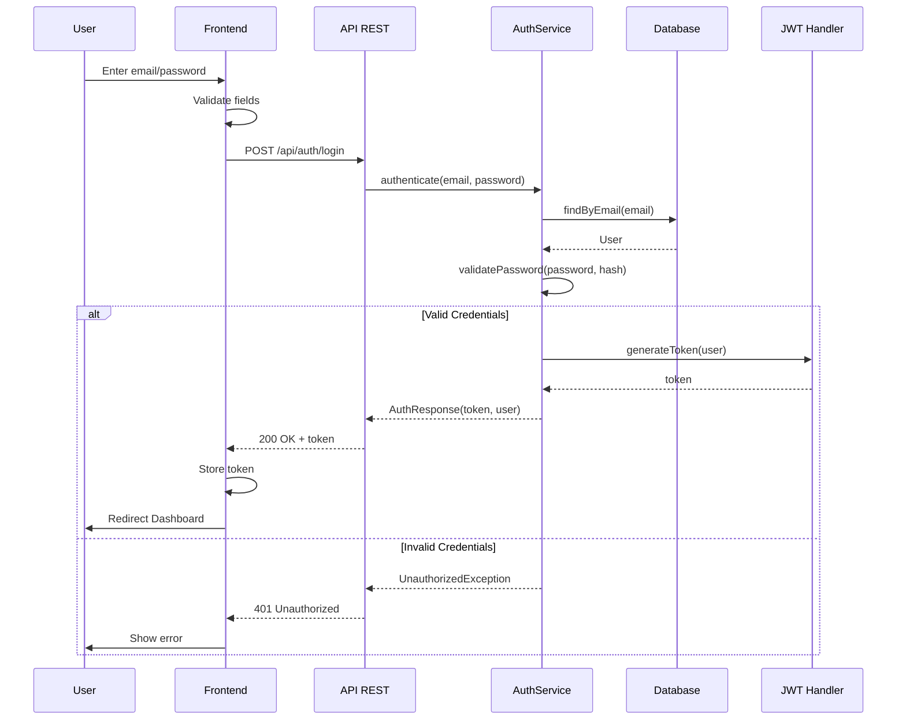
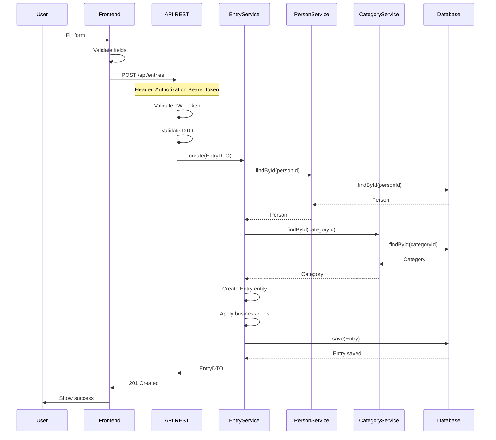
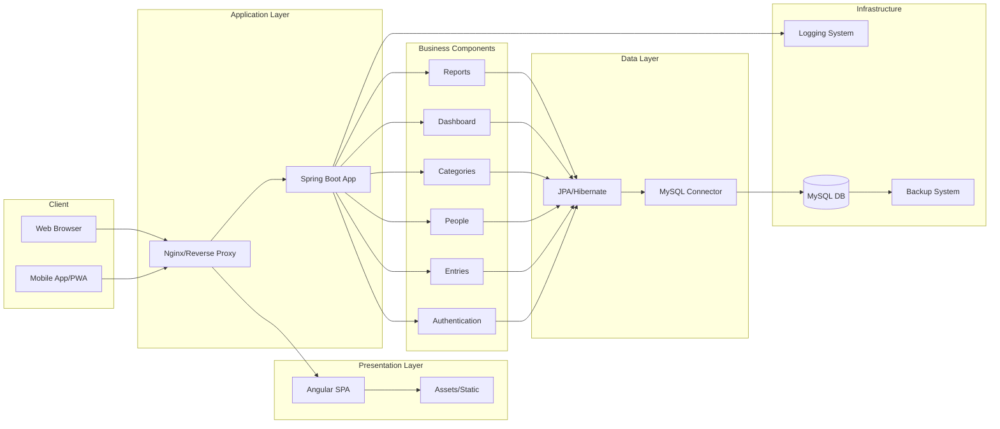
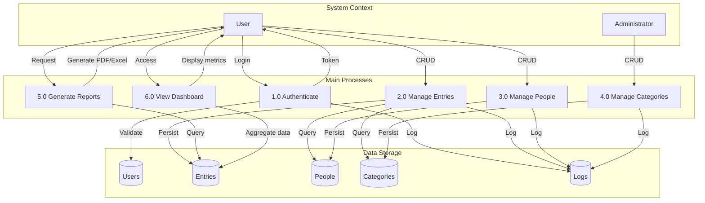
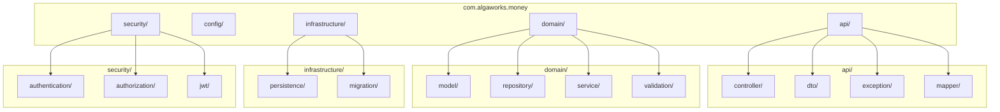

# Functional Requirements Document (FRD)
## Sistema de Lançamentos Financeiros - Estado Atual (Legado)

---

## 1. INFORMAÇÕES DO DOCUMENTO

| Item | Descrição |
|------|-----------|
| **Documento** | FRD - Functional Requirements Document |
| **Projeto** | Sistema de Lançamentos Financeiros |
| **Versão** | 1.0 - Estado Legado |
| **Data** | Agosto/2025 |
| **Autor** | Tech Lead Team |
| **Status** | Análise do Sistema Atual |
| **Repositório** | https://github.com/brunocesaromax/lancamentos |

---

## 2. SUMÁRIO EXECUTIVO

### 2.1 Visão Geral
O Sistema de Lançamentos é uma aplicação web full-stack desenvolvida para gerenciamento financeiro pessoal, permitindo o controle de entradas (créditos) e saídas (débitos) financeiras. O sistema foi originalmente construído como parte do curso Full Stack Angular and Spring da Algaworks.

### 2.2 Propósito
Fornecer uma ferramenta simples e eficaz para o controle financeiro pessoal através do registro e acompanhamento de transações financeiras.

### 2.3 Escopo
- Gestão de lançamentos financeiros (débitos e créditos)
- Autenticação de usuários
- Interface web responsiva
- Relatórios básicos de movimentação

---

## 3. ARQUITETURA TÉCNICA ATUAL

### 3.1 Stack Tecnológica

#### Backend (lancamentos-api)
| Tecnologia | Versão | Propósito | Status |
|------------|--------|-----------|---------|
| Java | 1.8 | Linguagem principal | ⚠️ EOL (End of Life) |
| Spring Boot | 2.3.7.RELEASE | Framework web | ⚠️ Desatualizado |
| Spring Data JPA | 2.3.x | ORM/Persistência | ⚠️ Versão antiga |
| Hibernate | 5.4.10.Final | JPA Provider | ⚠️ Versão antiga |
| Spring Security OAuth2 | 2.3.6.RELEASE | Autenticação/Autorização | ⚠️ Descontinuado |
| MySQL | MySQL Connector Java | Banco de dados | ✅ Adequado |
| Maven | 3.x | Build tool | ✅ Adequado |
| Lombok | 1.18.8 | Redução boilerplate | ✅ Adequado |
| Flyway | Core | Migração BD | ✅ Adequado |
| JasperReports | 6.16.0 | Geração relatórios | ✅ Adequado |
| AWS SDK | 1.11.327 | Integração S3 | ⚠️ Versão antiga |

#### Frontend (lancamentos-ui)
| Tecnologia | Versão | Propósito | Status |
|------------|--------|-----------|---------|
| Angular | 9.1.13 | Framework SPA | ⚠️ Descontinuado |
| TypeScript | 3.8.3 | Linguagem | ⚠️ Desatualizado |
| PrimeNG | 9.1.3 | Componentes UI | ⚠️ Versão antiga |
| Angular CLI | 9.1.13 | Ferramenta desenvolvimento | ⚠️ Versão antiga |
| Auth0 Angular JWT | 5.0.2 | Autenticação JWT | ⚠️ Versão antiga |
| Chart.js | 2.9.4 | Gráficos | ⚠️ Versão antiga |
| Node.js | 10.19.0 | Runtime | ⚠️ EOL |
| NPM | 6.14.11 | Package manager | ⚠️ Desatualizado |

### 3.2 Estrutura de Diretórios

```
lancamentos/
├── lancamentos-api/                 # Backend Application
│   ├── src/
│   │   ├── main/
│   │   │   ├── java/
│   │   │   │   └── com/example/lancamentoapi/
│   │   │   │       ├── controller/         # REST Controllers
│   │   │   │       ├── dto/               # Data Transfer Objects
│   │   │   │       ├── exceptionHandler/  # Exception handlers
│   │   │   │       ├── model/             # JPA Entities
│   │   │   │       ├── repository/        # Repositories
│   │   │   │       ├── service/           # Business logic
│   │   │   │       ├── configuration/     # Configurations
│   │   │   │       ├── security/          # Security
│   │   │   │       ├── cors/             # CORS Configuration
│   │   │   │       ├── event/            # Application Events
│   │   │   │       ├── mail/             # Email services
│   │   │   │       ├── storage/          # File storage (S3)
│   │   │   │       └── token/            # Token processing
│   │   │   └── resources/
│   │   │       ├── application.properties
│   │   │       ├── application-dev.properties
│   │   │       ├── application-prod.properties
│   │   │       ├── db/migration/         # Flyway migrations
│   │   │       ├── reports/             # JasperReports templates
│   │   │       └── templates/mail/      # Email templates
│   │   └── test/
│   │       └── java/                     # Unit tests
│   ├── pom.xml
│   ├── Procfile                         # Heroku deployment
│   └── system.properties                # Java version config
│
└── lancamentos-ui/                  # Frontend Application
    ├── src/
    │   ├── app/
    │   │   ├── core/                # Core module
    │   │   │   ├── model.ts         # TypeScript models
    │   │   │   ├── navbar/          # Navigation component
    │   │   │   └── error-handler.service.ts
    │   │   ├── launchs/             # Launch module
    │   │   │   ├── launch-form/     # Launch form component
    │   │   │   ├── launchs-search/  # Launch search component
    │   │   │   └── launch.service.ts
    │   │   ├── persons/             # Persons module
    │   │   │   ├── person-form/     # Person form component
    │   │   │   ├── persons-search/  # Person search component
    │   │   │   └── person.service.ts
    │   │   ├── categories/          # Categories module
    │   │   ├── dashboard/           # Dashboard module
    │   │   ├── reports/             # Reports module
    │   │   ├── security/            # Auth/Authorization
    │   │   │   ├── login-form/      # Login component
    │   │   │   └── auth.service.ts
    │   │   ├── shared/              # Shared components
    │   │   └── examples/            # Example components
    │   ├── assets/                  # Static resources
    │   ├── environments/            # Environment configs
    │   └── styles.css               # Global styles
    ├── angular.json
    ├── package.json
    ├── tsconfig.json
    ├── server.js                    # Express server
    └── README.md
```

---

## 4. REQUISITOS FUNCIONAIS

### 4.1 Módulo de Autenticação

#### RF001 - Login de Usuário
- **Descrição**: Sistema deve permitir autenticação de usuários
- **Critérios de Aceite**:
  - Validação de email e senha
  - Geração de token de sessão
  - Redirecionamento para dashboard após login
- **Dados de Teste**:
  - Email: admin@algamoney.com
  - Senha: admin

#### RF002 - Logout
- **Descrição**: Permitir que usuário encerre sua sessão
- **Critérios de Aceite**:
  - Invalidar token de sessão
  - Redirecionar para tela de login

#### RF003 - Controle de Sessão
- **Descrição**: Gerenciar tempo de sessão do usuário
- **Critérios de Aceite**:
  - Timeout de sessão após período de inatividade
  - Renovação automática de token

### 4.2 Módulo de Lançamentos

#### RF004 - Cadastrar Lançamento
- **Descrição**: Permitir registro de novo lançamento financeiro
- **Campos**:
  - Tipo (RECIPE/EXPENSE)
  - Descrição
  - Data de vencimento
  - Data de pagamento
  - Valor
  - Pessoa (credora/devedora)
  - Categoria
  - Observações
  - Anexo (opcional)
- **Validações**:
  - Campos obrigatórios: description, dueDate, value, type, category, person
  - Valor maior que zero
  - Datas válidas

#### RF005 - Listar Lançamentos
- **Descrição**: Exibir lista de lançamentos com filtros
- **Filtros**:
  - Por período (data início/fim)
  - Por tipo (receita/despesa)
  - Por categoria
  - Por pessoa
  - Por descrição
- **Funcionalidades**:
  - Paginação
  - Ordenação por colunas
  - Exportação para Excel/PDF

#### RF006 - Editar Lançamento
- **Descrição**: Permitir alteração de lançamento existente
- **Regras**:
  - Manter histórico de alterações
  - Validar permissões do usuário

#### RF007 - Excluir Lançamento
- **Descrição**: Permitir exclusão de lançamento
- **Regras**:
  - Solicitar confirmação
  - Soft delete (exclusão lógica)

#### RF008 - Duplicar Lançamento
- **Descrição**: Criar cópia de lançamento existente
- **Funcionalidade**:
  - Pré-preencher formulário com dados do lançamento original
  - Permitir edição antes de salvar

### 4.3 Módulo de Categorias

#### RF009 - Gerenciar Categorias
- **Funcionalidades**:
  - CRUD completo de categorias
  - Categorias pré-definidas no sistema
  - Associação com lançamentos

### 4.4 Módulo de Pessoas

#### RF010 - Gerenciar Pessoas
- **Descrição**: Cadastro de pessoas (credores/devedores)
- **Campos**:
  - Nome
  - CPF/CNPJ
  - Endereço completo
  - Contatos (telefone, email)
  - Status (ativo/inativo)

### 4.5 Módulo de Dashboard

#### RF011 - Dashboard Principal
- **Widgets**:
  - Saldo atual
  - Total de receitas (mês)
  - Total de despesas (mês)
  - Lançamentos pendentes
  - Gráfico de evolução mensal
  - Últimos lançamentos

### 4.6 Módulo de Relatórios

#### RF012 - Relatório de Movimentação
- **Descrição**: Relatório detalhado de entradas e saídas
- **Filtros**: Por período, categoria, pessoa
- **Formatos**: PDF, Excel, Visualização em tela

#### RF013 - Relatório de Fluxo de Caixa
- **Descrição**: Projeção de fluxo de caixa
- **Funcionalidades**:
  - Visualização mensal/anual
  - Comparativo previsto vs realizado

---

## 5. REQUISITOS NÃO FUNCIONAIS

### 5.1 Performance
| Requisito | Especificação | Status Atual |
|-----------|---------------|--------------|
| Tempo de resposta | < 3 segundos para operações simples | ⚠️ Não medido |
| Carga de usuários | Suportar 100 usuários simultâneos | ⚠️ Não testado |
| Volume de dados | Suportar 100k registros | ⚠️ Não validado |

### 5.2 Segurança
| Requisito | Implementação Atual | Status |
|-----------|-------------------|---------|
| Autenticação | Basic/Session Based | ⚠️ Básico |
| Autorização | Roles simples | ⚠️ Limitado |
| Criptografia | Senhas com hash | ✅ Implementado |
| HTTPS | Recomendado | ⚠️ Não enforced |
| CORS | Configurado | ✅ Implementado |

### 5.3 Usabilidade
- Interface responsiva (desktop/mobile)
- Compatibilidade com navegadores modernos
- Mensagens de erro claras
- Feedback visual de ações

### 5.4 Disponibilidade
- Meta: 99% de uptime
- Backup diário do banco de dados
- Plano de recuperação de desastres

---

## 6. MODELO DE DADOS

### 6.1 Entidades Principais

#### User (user)
```sql
- id: BIGINT (PK)
- name: VARCHAR(255)
- email: VARCHAR(255)
- password: VARCHAR(255)
```

#### Category (category)
```sql
- id: BIGINT (PK)
- name: VARCHAR(255)
```

#### Person (person)
```sql
- id: BIGINT (PK)
- name: VARCHAR(255)
- active: BOOLEAN
- street: VARCHAR(255)
- number: VARCHAR(255)
- complement: VARCHAR(255)
- neighborhood: VARCHAR(255)
- zip_code: VARCHAR(255)
- city_id: BIGINT (FK)
```

#### Launch (launch)
```sql
- id: BIGINT (PK)
- description: VARCHAR(255)
- due_date: DATE
- payday: DATE
- value: DECIMAL(10,2)
- type: ENUM('RECIPE', 'EXPENSE')
- observation: TEXT
- category_id: BIGINT (FK)
- person_id: BIGINT (FK)
- attachment: VARCHAR(255)
```

#### Address (address)
```sql
- id: BIGINT (PK)
- street: VARCHAR(200)
- number: VARCHAR(10)
- complement: VARCHAR(100)
- district: VARCHAR(100)
- zip_code: VARCHAR(10)
- city: VARCHAR(100)
- state: VARCHAR(2)
```

### 6.2 Relacionamentos
- User N:N Permission (através de user_permission)
- Category 1:N Launch
- Person 1:N Launch
- Person N:1 City (através de address)
- Person 1:N Contact
- City N:1 State

---

## 7. INTEGRAÇÕES E APIs

### 7.1 API REST - Endpoints Principais

#### Authentication
```
POST   /api/auth/login    - User login
POST   /api/auth/logout   - User logout
POST   /api/auth/refresh  - Refresh token
```

#### Launchs (Lançamentos)
```
GET    /launchs                    - List launchs (paginated)
GET    /launchs?summary           - List launchs summary
GET    /launchs/{id}              - Get launch by ID
POST   /launchs                   - Create new launch
PUT    /launchs/{id}              - Update launch
DELETE /launchs/{id}              - Delete launch
GET    /launchs/statistics/category - Statistics by category
GET    /launchs/statistics/day    - Statistics by day
GET    /launchs/reports/person    - Report by person
POST   /launchs/attachment        - Upload attachment
```

#### Categories
```
GET    /categories              - List categories
GET    /categories/{id}         - Get category
POST   /categories              - Create category
```

#### Persons (Pessoas)
```
GET    /persons                - List persons
GET    /persons?pagination     - List persons paginated
GET    /persons/{id}           - Get person
POST   /persons                - Create person
PUT    /persons/{id}           - Update person
PUT    /persons/{id}/active    - Update person active status
DELETE /persons/{id}           - Delete person
```

#### Dashboard
```
GET    /api/dashboard/summary  - Dashboard data
GET    /api/dashboard/charts   - Charts data
```

### 7.2 Formato de Resposta API

#### Success Response
```json
{
  "data": {
    // resource data
  },
  "metadata": {
    "timestamp": "2025-08-05T10:00:00Z",
    "path": "/api/resource",
    "version": "1.0"
  }
}
```

#### Error Response
```json
{
  "error": {
    "code": "VALIDATION_ERROR",
    "message": "Error description",
    "details": [
      {
        "field": "amount",
        "message": "Amount must be greater than zero"
      }
    ]
  },
  "metadata": {
    "timestamp": "2025-08-05T10:00:00Z",
    "path": "/api/resource"
  }
}
```

#### Pagination Response
```json
{
  "data": [...],
  "pagination": {
    "page": 1,
    "size": 20,
    "totalElements": 100,
    "totalPages": 5
  }
}
```

---

## 8. CONFIGURAÇÕES E DEPLOYMENT

### 8.1 Ambientes
| Ambiente | Propósito | Configuração |
|----------|-----------|--------------|
| Development | Desenvolvimento local | application-dev.properties |
| Staging | Testes integrados | application-stg.properties |
| Production | Produção | application-prod.properties |

### 8.2 Variáveis de Ambiente
```properties
# Database
DB_HOST=localhost
DB_PORT=3306
DB_NAME=money
DB_USER=root
DB_PASSWORD=root

# Application
APP_PORT=8080
APP_CONTEXT=/api

# Security
JWT_SECRET=secret-key
JWT_EXPIRATION=86400

# Frontend
API_URL=http://localhost:8080/api
```

### 8.3 Build e Deploy

#### Backend
```bash
# Build
mvn clean package

# Run
java -jar target/money-api.jar

# Docker
docker build -t money-api .
docker run -p 8080:8080 money-api
```

#### Frontend
```bash
# Install dependencies
npm install

# Development
ng serve

# Build production
ng build --prod

# Deploy (static files)
# Copy dist/* to web server
```

---

## 9. PROBLEMAS IDENTIFICADOS

### 9.1 Débitos Técnicos

#### Alta Prioridade 🔴
1. **Java 8 EOL**: Sem suporte de segurança desde 2019
2. **Spring Boot 2.3.x**: Versão descontinuada, vulnerabilidades não corrigidas
3. **Angular 9**: Descontinuado, sem atualizações de segurança
4. **Credenciais hardcoded**: Exposição de senhas no README

#### Média Prioridade 🟡
1. **Falta de testes automatizados**: Cobertura não especificada
2. **Ausência de CI/CD**: Deploy manual
3. **Sem containerização**: Dificuldade de deployment
4. **Documentação limitada**: Falta de documentação técnica detalhada
5. **Ausência de cache**: Performance não otimizada
6. **Logs não estruturados**: Dificuldade de troubleshooting

#### Baixa Prioridade 🟢
1. **UI/UX datada**: Interface precisa modernização
2. **Falta de PWA**: Sem suporte offline
3. **Internacionalização**: Apenas português

### 9.2 Limitações Funcionais
1. **Sem multi-tenancy**: Não suporta múltiplas empresas
2. **Relatórios básicos**: Falta analytics avançado
3. **Sem integração bancária**: Entrada manual de dados
4. **Sem anexos**: Não suporta upload de comprovantes
5. **Sem workflow**: Falta aprovações e fluxos
6. **Sem auditoria**: Não rastreia alterações

### 9.3 Riscos de Segurança
1. **Dependências vulneráveis**: Bibliotecas desatualizadas
2. **Sem rate limiting**: Vulnerável a ataques de força bruta
3. **CORS permissivo**: Configuração pode ser muito aberta
4. **Sem HTTPS enforced**: Tráfego pode ser interceptado
5. **Tokens sem refresh**: Sessões longas são risco

---

## 10. MÉTRICAS E KPIs

### 10.1 Métricas Técnicas
| Métrica | Valor Atual | Meta |
|---------|-------------|------|
| Cobertura de testes | < 20% | > 80% |
| Tempo de build | ~5 min | < 2 min |
| Tempo de deploy | Manual | < 10 min |
| Disponibilidade | Não medido | 99.9% |
| Tempo resposta API | Não medido | < 200ms |

### 10.2 Métricas de Negócio
| Métrica | Descrição |
|---------|-----------|
| Usuários ativos mensais | Quantidade de usuários únicos/mês |
| Lançamentos por usuário | Média de lançamentos/usuário |
| Taxa de retenção | % usuários que retornam |
| Tempo médio de sessão | Duração média de uso |

---

## 11. ROADMAP DE EVOLUÇÃO SUGERIDO

### Fase 1 - Estabilização (1-2 meses)
- [ ] Atualizar dependências críticas de segurança
- [ ] Implementar testes básicos
- [ ] Configurar ambiente Docker
- [ ] Documentar APIs com Swagger

### Fase 2 - Modernização (3-4 meses)
- [ ] Migrar para Java 21
- [ ] Atualizar Spring Boot 3.x
- [ ] Migrar Angular para Vue.js 3
- [ ] Migrar MySQL para PostgreSQL

### Fase 3 - Novas Features (2-3 meses)
- [ ] Implementar upload de comprovantes
- [ ] Adicionar dashboard analytics
- [ ] Integração bancária (OFX/API)
- [ ] Mobile app (PWA)

### Fase 4 - Escalabilidade (2-3 meses)
- [ ] Multi-tenancy
- [ ] Cache distribuído (Redis)
- [ ] Message queue (RabbitMQ)
- [ ] Microserviços (opcional)

---

## 12. CONSIDERAÇÕES FINAIS

### 12.1 Pontos Positivos
- Arquitetura bem organizada e modular
- Separação clara entre frontend e backend
- Uso de padrões estabelecidos (MVC, REST)
- Base sólida para evolução

### 12.2 Recomendações Imediatas
1. **Segurança**: Atualizar todas as dependências com vulnerabilidades conhecidas
2. **Documentação**: Criar documentação técnica completa
3. **Testes**: Implementar suite de testes automatizados
4. **CI/CD**: Configurar pipeline de deployment
5. **Monitoramento**: Implementar observabilidade

### 12.3 Estimativa de Esforço para Modernização
- **Equipe sugerida**: 2-3 desenvolvedores full-stack
- **Prazo total**: 8-12 meses para modernização completa
- **MVP modernizado**: 3-4 meses

---

## 13. DIAGRAMAS TÉCNICOS

### 13.1 Diagrama de Classes (Domain Model)



### 13.2 Diagrama de Entidade-Relacionamento (Banco de Dados)



### 13.3 Diagrama de Arquitetura de Sistema



### 13.4 Diagrama de Sequência - Fluxo de Autenticação



### 13.5 Diagrama de Sequência - Criar Lançamento



### 13.7 Diagrama de Componentes



### 13.8 Diagrama de Fluxo de Dados (DFD)



### 13.9 Estrutura de Pacotes Java (Backend)



### 13.10 Estrutura de Módulos Angular (Frontend)

```mermaid
graph TD
    subgraph "src/app"
        CORE[core/]
        FEATURES[features/]
        SHARED[shared/]
        LAYOUT[layout/]
    end
    
    subgraph "core/"
        MODELS[models/]
        SERVICES[services/]
        GUARDS[guards/]
        INTERCEPTORS[interceptors/]
    end
    
    subgraph "features/"
        ENTRIES[entries/]
        CATEGORIES[categories/]
        PEOPLE[people/]
        DASHBOARD[dashboard/]
        REPORTS[reports/]
        AUTH_MODULE[auth/]
    end
    
    subgraph "shared/"
        COMPONENTS[components/]
        DIRECTIVES[directives/]
        PIPES[pipes/]
        UTILS[utils/]
    end
    
    subgraph "layout/"
        HEADER[header/]
        FOOTER[footer/]
        SIDEBAR[sidebar/]
        MAIN[main-layout/]
    end
    
    CORE --> MODELS
    CORE --> SERVICES
    CORE --> GUARDS
    CORE --> INTERCEPTORS
    
    FEATURES --> ENTRIES
    FEATURES --> CATEGORIES
    FEATURES --> PEOPLE
    FEATURES --> DASHBOARD
    FEATURES --> REPORTS
    FEATURES --> AUTH_MODULE
    
    SHARED --> COMPONENTS
    SHARED --> DIRECTIVES
    SHARED --> PIPES
    SHARED --> UTILS
    
    LAYOUT --> HEADER
    LAYOUT --> FOOTER
    LAYOUT --> SIDEBAR
    LAYOUT --> MAIN
```



---

## 14. ANEXOS

### A. Glossário
- **FRD**: Functional Requirements Document
- **EOL**: End of Life (fim de suporte)
- **CRUD**: Create, Read, Update, Delete
- **JWT**: JSON Web Token
- **PWA**: Progressive Web App
- **SPA**: Single Page Application

### B. Referências
- [Spring Boot Documentation](https://spring.io/projects/spring-boot)
- [Angular Documentation](https://angular.io/docs)
- [PrimeNG Components](https://www.primefaces.org/primeng/)
- [RESTful API Best Practices](https://restfulapi.net/)

### C. Controle de Versões do Documento
| Versão | Data | Autor | Descrição |
|--------|------|-------|-----------|
| 1.0 | 05/08/2025 | Tech Lead | Versão inicial - Análise do sistema legado |

---

**Nota**: Este documento representa o estado atual (AS-IS) do sistema e serve como base para o planejamento da modernização (TO-BE). Recomenda-se sua atualização conforme novas descobertas durante a análise detalhada do código-fonte.