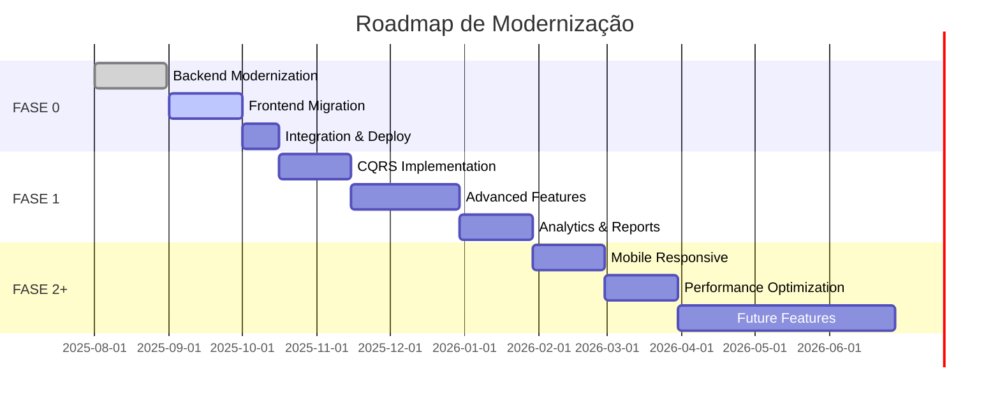
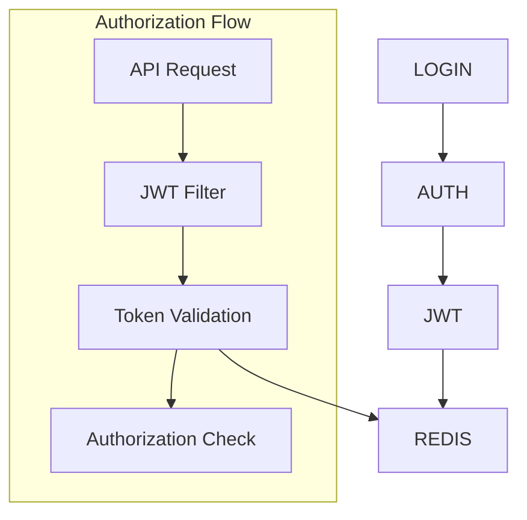
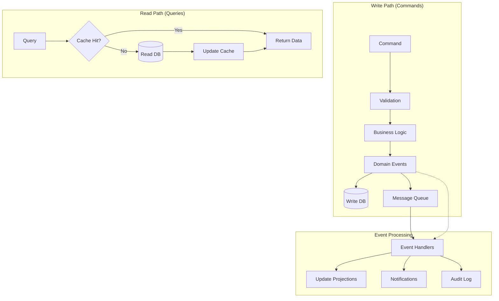
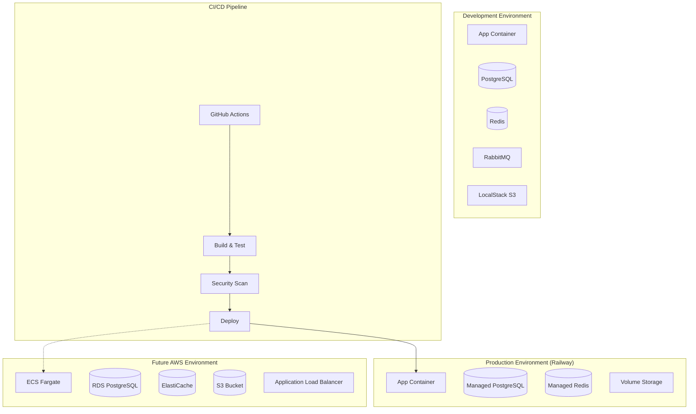
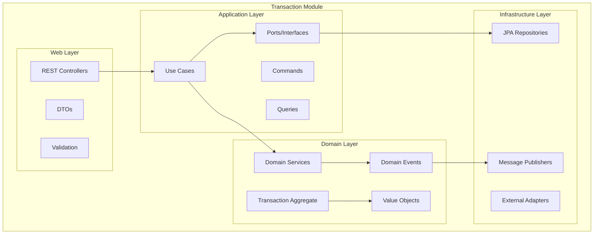
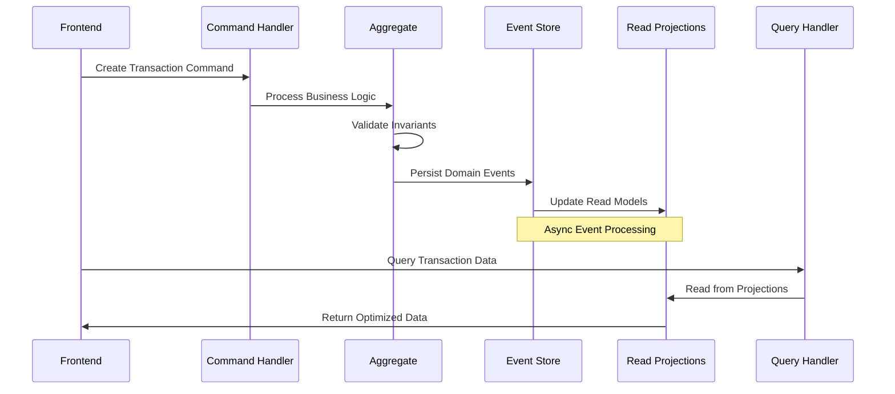

# 📋 FRD - MODERNIZAÇÃO SISTEMA DE LANÇAMENTOS FINANCEIROS

**Versão:** 1.0  
**Data:** Agosto 2025  
**Autor:** Bruno César  
**Repositório:** https://github.com/brunocesaromax/lancamentos

---

## 📑 ÍNDICE

1. [Visão do Produto](#1-visão-do-produto)
2. [Requisitos Funcionais](#2-requisitos-funcionais)
3. [Arquitetura Técnica](#3-arquitetura-técnica)
4. [Segurança e Compliance](#4-segurança-e-compliance)
5. [Infraestrutura e DevOps](#5-infraestrutura-e-devops)
6. [Recursos](#6-recursos)
7. [Estratégia de Migração](#7-estratégia-de-migração)
8. [Roadmap e Cronograma](#8-roadmap-e-cronograma)
9. [Diagramas Técnicos](#9-diagramas-técnicos)

---

## 1. VISÃO DO PRODUTO

### 1.1 Objetivo Principal
Modernizar sistema legado de gestão financeira pessoal para criar um **portfolio técnico impressionante** demonstrando conhecimentos avançados de arquitetura de software, aplicando conceitos de pós-graduação em um projeto real e escalável.

### 1.2 Modelo de Negócio Evolutivo
```yaml
FASE 0-1: Uso próprio + Portfolio técnico
FASE 2: Freemium (5 usuários gratuitos)
FASE 3: SaaS (planos pagos)
```

### 1.3 Escala e Público-alvo
- **MVP:** 5 usuários iniciais
- **Ano 1:** Crescimento para 20 usuários
- **Público:** Pessoas físicas para controle financeiro pessoal
- **Referência:** Organizze (funcionalidades core)

### 1.4 Diferencial Competitivo
- Interface simples e intuitiva
- Preço acessível
- Arquitetura moderna e escalável
- Preparado para futuras integrações de IA

---

## 2. REQUISITOS FUNCIONAIS

### 2.1 Prioridades de Desenvolvimento

**PRIORIDADE MÁXIMA (FASE 0):**
- Modernização técnica completa
- Clean Architecture implementada
- Cobertura de testes ≥ 80%
- CI/CD pipeline robusto

**PRIORIDADE ALTA (FASE 1):**
- CQRS implementation
- Domain Events + mensageria
- Dashboard analytics melhorado
- Import OFX/CSV
- Múltiplas contas
- Lançamentos recorrentes

**PRIORIDADE MÉDIA (FASE 2+):**
- Mobile responsivo (PWA)
- Multi-tenancy
- Features IA (futuro)
- Performance avançada

### 2.2 Features Essenciais Mapeadas

#### 2.2.1 Gestão de Transações (Core)
```yaml
✓ CRUD completo de lançamentos
✓ Categorização manual e automática
✓ Filtros avançados (data, categoria, valor)
✓ Busca por descrição
✓ Lançamentos recorrentes
✓ Transferências entre contas
✓ Import OFX/CSV
```

#### 2.2.2 Cadastros Base
```yaml
✓ Gestão de categorias (receitas/despesas)
✓ Gestão de contas bancárias
✓ Gestão de pessoas/contatos
✓ Centros de custo
```

#### 2.2.3 Analytics e Relatórios
```yaml
✓ Dashboard executivo
✓ Gráficos de evolução temporal
✓ Análise por categorias
✓ Relatórios customizáveis
✓ Export de relatórios (PDF/Excel)
```

#### 2.2.4 Gestão de Usuários
```yaml
✓ Autenticação JWT + Refresh Token
✓ Perfis de acesso
✓ Auditoria de ações
✓ Configurações pessoais
```

---

## 3. ARQUITETURA TÉCNICA

### 3.1 Padrões Arquiteturais

#### 3.1.1 Clean Architecture (Uncle Bob)
```
📁 financial-api/
├── 📁 modules/
│   ├── 📁 transaction/          # Core Business (Lançamentos)
│   │   ├── 📁 domain/          # Entities, Value Objects, Domain Services
│   │   ├── 📁 application/     # Use Cases, Ports
│   │   ├── 📁 infrastructure/  # Adapters, Repositories
│   │   └── 📁 web/            # Controllers, DTOs
│   ├── 📁 identity/            # Autenticação
│   ├── 📁 registry/            # Cadastros (Categorias, Pessoas)
│   ├── 📁 analytics/           # Dashboard, Relatórios
│   ├── 📁 document/            # Upload, Export
│   └── 📁 notification/        # Alertas, Email
└── 📁 shared/
    ├── 📁 kernel/              # Domain primitives, Common interfaces
    └── 📁 infrastructure/      # Cross-cutting concerns
```

#### 3.1.2 Domain-Driven Design (DDD)
```yaml
Bounded Contexts:
  - Core: Transaction Management
  - Identity: User & Authentication
  - Registry: Master Data (Categories, Accounts)
  - Analytics: Reports & Insights
  - Documents: File Management
  - Notifications: Alerts & Communication

Aggregates:
  - Transaction (Root) + TransactionItems
  - Account + AccountBalance
  - Category + Subcategories
  - User + UserPreferences
```

#### 3.1.3 CQRS (Command Query Responsibility Segregation)
```yaml
Commands (Write):
  - CreateTransactionCommand
  - UpdateTransactionCommand
  - DeleteTransactionCommand

Queries (Read):
  - GetTransactionsByPeriodQuery
  - GetCategoryAnalyticsQuery
  - GetDashboardSummaryQuery

Events:
  - TransactionCreatedEvent
  - CategoryChangedEvent
  - AccountBalanceUpdatedEvent
```

### 3.2 Stack Tecnológica

#### 3.2.1 Backend
```yaml
Core:
  - Java 21 (LTS)
  - Spring Boot 3.3.x
  - Spring Security 6
  - Spring Data JPA
  - Spring Cloud (futuro)

Database:
  - PostgreSQL 16
  - Flyway (migrations)
  - Redis (cache L2)

Messaging:
  - RabbitMQ (Domain Events)
  - Spring Cloud Stream

Testing:
  - JUnit 5
  - TestContainers
  - WireMock
  - JaCoCo (80%+ coverage)

Build:
  - Maven 3.9+
  - Java 21 compliance
```

#### 3.2.2 Frontend
```yaml
Core:
  - Vue.js 3.5+ (Composition API)
  - TypeScript 5+
  - Vite 5+ (build tool)

State Management:
  - Pinia (Vuex successor)

UI/UX:
  - Tailwind CSS
  - HeadlessUI/Radix
  - Chart.js/ApexCharts

Testing:
  - Vitest (unit tests)
  - Cypress (E2E críticos)

Build:
  - Vite build
  - TypeScript strict mode
```

#### 3.2.3 DevOps
```yaml
Containerização:
  - Docker + Docker Compose
  - Multi-stage builds
  - K8s ready (futuro)

CI/CD:
  - GitHub Actions (workflows especializados)
  - SonarCloud (quality gates)
  - OWASP Dependency Check

Cloud:
  - FASE 1: Railway/Render (gratuito)
  - FASE 2: AWS migration
  - LocalStack (development)
```

### 3.3 Decisões Técnicas Específicas

#### 3.3.1 APIs e Integrações
```yaml
API Strategy:
  - REST APIs (JSON)
  - Versionamento via URL path (/api/v1/)
  - OpenAPI 3.0 documentation
  - HATEOAS (Richardson Level 3)

Future Evolution:
  - GraphQL gateway (agregação)
  - gRPC interno (microservices)
```

#### 3.3.2 Cache Strategy
```yaml
L1 Cache: Spring Cache + Caffeine (5-10 min)
  - User sessions
  - Static data (categories)

L2 Cache: Redis (30-60 min)
  - Query results
  - Computed aggregations
  - Session store

L3 Cache: CDN (futuro)
  - Static assets
  - Public content
```

#### 3.3.3 Convenções Técnicas
```yaml
Código: 100% em inglês
Timezone: UTC backend, conversão frontend
Paginação: Offset pagination (Spring Data)
Upload: Via backend → S3/LocalStack
Logs: Structured JSON + Correlation IDs
```

---

## 4. SEGURANÇA E COMPLIANCE

### 4.1 Autenticação e Autorização

#### 4.1.1 JWT Strategy
```yaml
Access Token:
  - Duração: 15 minutos
  - Payload: user_id, roles, permissions
  - Algoritmo: RS256

Refresh Token:
  - Duração: 7 dias
  - Rotação automática
  - Stored in Redis (blacklist capability)
  - HttpOnly cookie (web) + secure storage (mobile)
```

#### 4.1.2 Session Management
```yaml
Redis Session Store:
  - Active sessions tracking
  - Concurrent session limits
  - Instant revocation capability
  - Session analytics

Security Headers:
  - X-Content-Type-Options: nosniff
  - X-Frame-Options: DENY
  - X-XSS-Protection: 1; mode=block
  - Strict-Transport-Security
```

### 4.2 Segurança por Fase

#### 4.2.1 FASE 0 - Modernização Básica
```yaml
✓ BCrypt password hashing (strength 12)
✓ JWT básico com validação
✓ HTTPS obrigatório
✓ CORS configurado adequadamente
✓ Input validation (Bean Validation)
✓ SQL Injection protection (JPA parameterized)
✓ Rate limiting básico
```

#### 4.2.2 FASE 1 - MVP Seguro
```yaml
✓ Refresh token com rotação
✓ Redis session store
✓ Rate limiting avançado (Bucket4j)
✓ Audit logging completo
✓ Sensitive data masking em logs
✓ OWASP Dependency Check no CI/CD
✓ Security headers completos
```

#### 4.2.3 FASE 2+ - Enterprise
```yaml
✓ AWS Secrets Manager
✓ 2FA/MFA implementation
✓ LGPD compliance toolkit
✓ Security monitoring
✓ Penetration testing
✓ Vulnerability scanning
```

### 4.3 Validação em Camadas

#### 4.3.1 Arquitetura de Validação
```yaml
1. Controller Layer:
   - Bean Validation (@Valid, @NotNull, etc)
   - Sintactic validation
   - Format validation

2. Application Layer (Use Cases):
   - Business rules validation
   - Cross-entity validation
   - Authorization checks

3. Domain Layer:
   - Entity invariants
   - Value objects validation
   - Domain constraints

4. Infrastructure Layer:
   - Database constraints
   - Unique key validation
   - Referential integrity
```

### 4.4 LGPD Compliance (Preparação)

#### 4.4.1 Data Protection
```yaml
Princípios:
  - Minimização de dados
  - Pseudonimização de PII
  - Criptografia em trânsito e repouso
  - Retention policies definidas

Direitos do Titular:
  - Data portability (export JSON/CSV)
  - Right to erasure (soft delete + anonymization)
  - Data rectification
  - Access request
```

---

## 5. INFRAESTRUTURA E DEVOPS

### 5.1 Estratégia de Containerização

#### 5.1.1 Docker Strategy (FASE 1)
```yaml
Estrutura:
  docker-compose.yml          # Produção
  docker-compose.dev.yml      # Desenvolvimento
  docker-compose.test.yml     # Testes automatizados

Multi-stage builds:
  - build: Maven + Java compilation
  - runtime: JRE slim + app optimized
  - Size target: <200MB final image
```

#### 5.1.2 Kubernetes Preparation (FASE 2+)
```yaml
Roadmap para K8s:
  - Helm charts preparation
  - ConfigMaps e Secrets structure
  - Service mesh ready
  - Ingress controller setup
  - Horizontal Pod Autoscaling
```

### 5.2 CI/CD Pipeline

#### 5.2.1 GitHub Actions Workflows
```yaml
📁 .github/workflows/
├── 📄 build.yml              # Build & Unit Tests
├── 📄 test-integration.yml   # Integration Tests
├── 📄 security-scan.yml      # OWASP + SonarCloud
├── 📄 deploy-dev.yml         # Auto deploy to dev
└── 📄 deploy-prod.yml        # Manual deploy to prod
```

#### 5.2.2 Pipeline Stages
```yaml
Trigger: Push to main/dev branches

Stage 1 - Build & Test (Parallel):
├─ Backend build (Maven)
├─ Frontend build (Vite)
├─ Unit tests execution
└─ Code coverage report

Stage 2 - Quality & Security:
├─ SonarCloud analysis
├─ OWASP dependency check
├─ Code quality gates (80% coverage)
└─ Security vulnerability scan

Stage 3 - Package:
├─ Docker image build
├─ Image security scan
├─ Push to registry
└─ Tag versioning

Stage 4 - Deploy:
├─ Development (automatic)
├─ Production (manual approval)
└─ Rollback capability
```

### 5.3 Ambientes e Deploy

#### 5.3.1 Environment Strategy
```yaml
Development:
  - Local: Docker Compose
  - Database: PostgreSQL local
  - Cache: Redis local
  - Files: LocalStack S3
  - URL: localhost:8080

Production (FASE 1):
  - Platform: Railway/Render (free tier)
  - Database: Managed PostgreSQL
  - Cache: Managed Redis
  - Files: Railway volumes
  - Domain: Custom domain
```

#### 5.3.2 Future AWS Migration (FASE 2)
```yaml
Production (FASE 2):
  - Compute: ECS Fargate / EKS
  - Database: RDS PostgreSQL
  - Cache: ElastiCache Redis
  - Files: S3 + CloudFront
  - Monitoring: CloudWatch
  - Secrets: AWS Secrets Manager
```

### 5.4 Monitoramento e Observabilidade

#### 5.4.1 Health Checks
```yaml
Spring Actuator Endpoints:
  /actuator/health           # Basic health
  /actuator/health/database  # DB connectivity
  /actuator/health/redis     # Cache connectivity
  /actuator/metrics          # Application metrics
  /actuator/info            # Build info

Custom Health Indicators:
  - External API connectivity
  - Message queue health
  - Disk space monitoring
  - Memory usage thresholds
```

#### 5.4.2 Logging Strategy
```yaml
Log Levels:
  - DEBUG: Development only
  - INFO: Business events
  - WARN: Recoverable errors
  - ERROR: Application errors

Structured Logging:
  - JSON format
  - Correlation IDs
  - User context
  - Request tracing
  - Sensitive data masking

Log Aggregation:
  - FASE 1: Application logs only
  - FASE 2: ELK Stack / CloudWatch
```

### 5.5 Backup e Disaster Recovery

#### 5.5.1 Backup Strategy (FASE 1)
```yaml
Database:
  - Railway automated backups (7 dias)
  - Manual pg_dump exports (weekly)
  - Recovery procedures documented

Application:
  - Code in Git (multiple remotes)
  - Configuration in environment variables
  - Docker images in registry

RTO: 2-4 horas
RPO: 24 horas
```

#### 5.5.2 DR Plan Básico
```yaml
Cenários:
1. Application failure:
   └─ Restart container/service
   └─ Rollback to previous version

2. Database corruption:
   └─ Restore from automated backup
   └─ Apply transaction logs if available

3. Platform failure (Railway):
   └─ Migrate to backup platform
   └─ Update DNS records
   └─ Restore database backup

4. Complete disaster:
   └─ Rebuild from Infrastructure as Code
   └─ Restore latest backup
   └─ Communicate with users
```

---

## 6. RECURSOS

### 6.1 Equipe e Responsabilidades

#### 6.1.1 Configuração Atual
```yaml
Desenvolvedor Principal (Bruno):
  - Arquitetura de sistema
  - Backend development (Java/Spring)
  - DevOps e infraestrutura
  - Documentação técnica
  - Code review e qualidade

Possível Apoio Frontend:
  - Vue.js development
  - UI/UX implementation
  - Responsive design
  - Frontend testing
```

#### 6.1.2 Code Review Strategy
```yaml
Ferramentas:
  - SonarCloud (automated analysis)
  - GitHub PR reviews
  - AI-assisted code review (Claude/GPT)

Documento de Review:
  - Padrões de código definidos
  - Checklist de qualidade
  - Security guidelines
  - Performance best practices
```

### 6.2 Timeline e Marcos

#### 6.2.1 Cronograma Flexível
```yaml
FASE 0 - Modernização (2 meses):
  ├─ Sprint 1-2: Backend modernization
  ├─ Sprint 3-4: Frontend migration
  └─ Sprint 5-6: Integration & deployment

FASE 1 - MVP Features (3 meses):
  ├─ Sprint 7-8: CQRS + Events
  ├─ Sprint 9-10: Advanced features
  └─ Sprint 11-12: Analytics & reports

FASE 2+ - Evolução (3+ meses):
  ├─ Sprint 13-14: Mobile responsivo
  ├─ Sprint 15-16: Performance optimization
  └─ Sprint 17+: Advanced features
```

### 6.3 Orçamento

#### 6.3.1 Custos por Fase
```yaml
FASE 0-1 (Desenvolvimento):
  - Hospedagem: $0/mês (Railway free)
  - Domínio: $12/ano (~$1/mês)
  - Tools: $0/mês (GitHub, SonarCloud free)
  - Total: ~$1/mês

FASE 2 (Produção):
  - Hospedagem: $5-10/mês (Railway Pro)
  - Database: Incluído na hospedagem
  - CDN/Storage: $1-2/mês
  - Monitoring: $0/mês (free tiers)
  - Total: ~$6-12/mês

FASE 3+ (Escala):
  - AWS Infrastructure: $20-50/mês
  - Third-party services: $10-30/mês
  - Monitoring tools: $20-40/mês
  - Total: ~$50-120/mês
```

---

## 7. ESTRATÉGIA DE MIGRAÇÃO

### 7.1 Estratégia de Branches

#### 7.1.1 Git Workflow
```yaml
Estrutura:
├─ main                           # Legado (Spring Boot 2.3.7)
├─ modernization/backend          # Java 21 + Clean Architecture
├─ modernization/frontend         # Vue.js 3
├─ modernization/integration      # Testes E2E
└─ modernization/merged          # Branch final → main
```

#### 7.1.2 Processo de Migração
```yaml
1. Desenvolver backend moderno em paralelo
2. Manter contratos de API compatíveis
3. Migrar frontend usando APIs modernas
4. Executar testes de paridade funcional
5. Merge quando 100% das features OK
6. Tag final: v2.0.0 (modernizado)
```

### 7.2 Paridade Funcional

#### 7.2.1 Checklist de Migração
```yaml
Core Features:
✓ CRUD Lançamentos (Transaction)
✓ CRUD Categorias
✓ CRUD Pessoas/Contas
✓ Dashboard básico
✓ Relatórios simples
✓ Autenticação/autorização
✓ Filtros e buscas
✓ Export de dados
✓ Configurações usuário

API Compatibility:
✓ Mesmos endpoints REST
✓ Mesma estrutura JSON
✓ Headers de resposta
✓ Status codes corretos
✓ Error messages consistentes
```

#### 7.2.2 Testing Strategy
```yaml
1. Baseline Tests (Sistema Legado):
   - Test suite completo atual
   - Performance benchmarks
   - API contract tests

2. Migration Tests (Sistema Moderno):
   - Mesmos testes funcionais
   - Novos testes para arquitetura
   - Performance comparativa

3. End-to-End Tests:
   - Cypress tests críticos
   - User journey completo
   - Cross-browser testing
```

### 7.3 Migração de Dados

#### 7.3.1 Database Migration
```yaml
Schema Changes:
  - Flyway migration scripts
  - Backward compatibility durante transição
  - Rollback scripts testados

Data Integrity:
  - Foreign key preservation
  - Audit trail maintained
  - Checksum validation
  - Automated post-migration checks

Migration Process:
  1. Full backup antes da migração
  2. Execute Flyway migrations
  3. Data validation queries
  4. Rollback test (dry run)
  5. Performance validation
```

### 7.4 Rollback Plan

#### 7.4.1 Cenários de Rollback
```yaml
Scenario A - Bug Crítico:
  └─ Immediate rollback para main branch
  └─ Hotfix no sistema legado se necessário
  └─ Continue desenvolvimento em paralelo

Scenario B - Performance Issues:
  └─ Identify bottlenecks rapidamente
  └─ Rollback temporário se necessário
  └─ Fix performance antes re-deploy

Scenario C - Data Corruption:
  └─ Stop application immediately
  └─ Restore from backup
  └─ Investigate root cause
  └─ Fix antes retry migration
```

### 7.5 Timeline Detalhada FASE 0

#### 7.5.1 Backend Migration (Mês 1)
```yaml
Semana 1: Foundation
├─ Java 21 + Spring Boot 3.3.x setup
├─ Clean Architecture structure
├─ Core domain entities
└─ Basic repository interfaces

Semana 2: Domain Layer
├─ Transaction aggregate
├─ Category value objects
├─ Domain services
└─ Domain events structure

Semana 3: Application Layer
├─ Use cases implementation
├─ Command/Query handlers
├─ Application services
└─ DTO mappings

Semana 4: Infrastructure
├─ JPA repositories
├─ REST controllers
├─ Configuration setup
└─ Basic integration tests
```

#### 7.5.2 Frontend Migration (Mês 2)
```yaml
Semana 5: Vue.js Setup
├─ Vite + TypeScript configuration
├─ Router setup
├─ Pinia store structure
└─ Base components

Semana 6: Core Pages
├─ Login/Authentication
├─ Dashboard layout
├─ Transaction CRUD
└─ Category management

Semana 7: Advanced Features
├─ Reports page
├─ Settings page
├─ Charts integration
└─ Responsive design

Semana 8: Integration & Deploy
├─ Docker setup
├─ CI/CD pipeline
├─ Railway deployment
└─ E2E testing
```

---

## 8. ROADMAP E CRONOGRAMA

### 8.1 Visão Geral dos Marcos



### 8.2 Marcos Técnicos Detalhados

#### 8.2.1 FASE 0 - Modernização (Meses 1-2)
```yaml
Objetivos:
✓ Migração completa de tecnologias
✓ Manter 100% paridade funcional
✓ Zero breaking changes
✓ Deploy automatizado funcionando

Entregas:
✓ Java 21 + Spring Boot 3.3.x
✓ Vue.js 3 + TypeScript 5
✓ PostgreSQL + Redis
✓ Docker + CI/CD
✓ Clean Architecture implementada
✓ Testes 80%+ coverage
✓ Deploy Railway funcionando

Success Criteria:
✓ Todas as features atuais funcionando
✓ Performance igual ou melhor
✓ Build pipeline verde
✓ Zero debt técnico bloqueante
```

#### 8.2.2 FASE 1 - MVP Avançado (Meses 3-5)
```yaml
Objetivos:
✓ Implementar arquitetura avançada
✓ Adicionar features competitivas
✓ Preparar para escala

Entregas:
✓ CQRS + Domain Events
✓ RabbitMQ messaging
✓ Import OFX/CSV
✓ Múltiplas contas
✓ Lançamentos recorrentes
✓ Dashboard analytics avançado
✓ Rate limiting + security
✓ Observabilidade básica

Success Criteria:
✓ Arquitetura enterprise-grade
✓ Performance otimizada
✓ Features diferenciadas
✓ Security hardening completo
```

#### 8.2.3 FASE 2+ - Evolução (Meses 6+)
```yaml
Objetivos:
✓ Preparar para crescimento
✓ Features inovadoras
✓ Platform consolidation

Entregas:
✓ Mobile PWA
✓ Multi-tenancy
✓ AWS migration
✓ K8s deployment
✓ Advanced analytics
✓ AI/ML features (futuro)
✓ API marketplace ready

Success Criteria:
✓ Escalabilidade horizontal
✓ Multi-tenant ready
✓ Cloud-native
✓ Product-market fit validation
```

---

## 9. DIAGRAMAS TÉCNICOS

### 9.1 Arquitetura Geral do Sistema



### 9.5 Data Flow Architecture



### 9.6 Deployment Architecture



---

## 🎯 CRITÉRIOS DE SUCESSO

### Técnicos
- ✅ Clean Architecture bem implementada
- ✅ Cobertura de testes ≥ 80%
- ✅ Performance igual ou superior ao legado
- ✅ Zero breaking changes na migração
- ✅ CI/CD pipeline robusto
- ✅ Security hardening completo

### Negócio
- ✅ 100% paridade funcional
- ✅ UX mantida ou melhorada
- ✅ Deploy automatizado funcionando
- ✅ Documentação técnica completa
- ✅ Portfolio técnico impressionante

### Operacionais
- ✅ Rollback plan testado
- ✅ Monitoring e alertas ativos
- ✅ Backup strategy implementada
- ✅ DR procedures documentados

---

## 📚 REFERÊNCIAS E DOCUMENTAÇÃO

### Documentação Técnica
- [Clean Architecture - Uncle Bob](https://blog.cleancoder.com/uncle-bob/2012/08/13/the-clean-architecture.html)
- [Domain-Driven Design](https://martinfowler.com/tags/domain%20driven%20design.html)
- [CQRS Pattern](https://martinfowler.com/bliki/CQRS.html)
- [Spring Boot 3 Documentation](https://docs.spring.io/spring-boot/docs/current/reference/htmlsingle/)
- [Vue.js 3 Documentation](https://vuejs.org/guide/)

### Stack References
- Java 21 LTS
- Spring Boot 3.3.x
- Vue.js 3.5+
- PostgreSQL 16
- Docker & Kubernetes

### Project Structure
```
financial-api/
├── docs/                    # Toda documentação do projeto
│   ├── architecture/        # Diagramas e decisões arquiteturais
│   ├── api/                # Documentação das APIs
│   ├── deployment/         # Guias de deploy e infra
│   └── development/        # Guias para desenvolvedores
├── CLAUDE.md               # Instruções para o AI agent
├── README.md               # Visão geral do projeto
└── src/                    # Código fonte
```

---

**📋 CHECKLIST DE IMPLEMENTAÇÃO**

### FASE 0 - Modernização
- [ ] Setup Java 21 + Spring Boot 3.3.x
- [ ] Migrar para PostgreSQL + Flyway
- [ ] Implementar Clean Architecture
- [ ] Migrar frontend para Vue.js 3
- [ ] Setup Docker + Docker Compose
- [ ] Configurar CI/CD GitHub Actions
- [ ] Deploy Railway funcionando
- [ ] Testes 80%+ coverage
- [ ] Documentação completa

### FASE 1 - MVP Avançado
- [ ] Implementar CQRS pattern
- [ ] Setup RabbitMQ + Domain Events
- [ ] Features avançadas (import, recorrência)
- [ ] Dashboard analytics
- [ ] Security hardening
- [ ] Rate limiting
- [ ] Monitoring básico

### FASE 2+ - Evolução
- [ ] Mobile PWA
- [ ] Multi-tenancy
- [ ] AWS migration
- [ ] Kubernetes deployment
- [ ] Advanced features
- [ ] AI/ML integration (futuro)

---

**VERSÃO:** 1.0  
**ÚLTIMA ATUALIZAÇÃO:** Agosto 2025  
**PRÓXIMA REVISÃO:** Após conclusão FASE 0 "Frontend Layer"
        VUE[Vue.js 3 + TypeScript]
        PWA[PWA Capabilities]
    end

    subgraph "API Gateway Layer"
        GW[Spring Boot Gateway<br/>Rate Limiting + Auth]
    end

    subgraph "Application Layer"
        subgraph "Core Modules"
            TXN[Transaction Module]
            IDT[Identity Module]
            REG[Registry Module]
            ANA[Analytics Module]
        end
    end

    subgraph "Infrastructure Layer"
        DB[(PostgreSQL)]
        CACHE[(Redis Cache)]
        MQ[RabbitMQ]
        FILES[File Storage<br/>S3/LocalStack]
    end

    subgraph "External Services"
        BANKS[Banking APIs<br/>Future Integration]
        NOTIF[Email/SMS<br/>Services]
    end

    VUE --> GW
    PWA --> GW
    GW --> TXN
    GW --> IDT
    GW --> REG
    GW --> ANA

    TXN --> DB
    TXN --> CACHE
    TXN --> MQ
    REG --> DB
    ANA --> DB
    ANA --> CACHE

    MQ --> NOTIF
    TXN --> FILES
    
    TXN -.-> BANKS
```

### 9.2 Clean Architecture - Module Structure



### 9.3 CQRS + Event Sourcing Flow



### 9.4 Security Architecture

```mermaid
graph LR
    subgraph "Authentication Flow"
        LOGIN[Login Request]
        AUTH[Auth Service]
        JWT[JWT Generator]
        REDIS[(Redis Session)]
    end

    subgraph