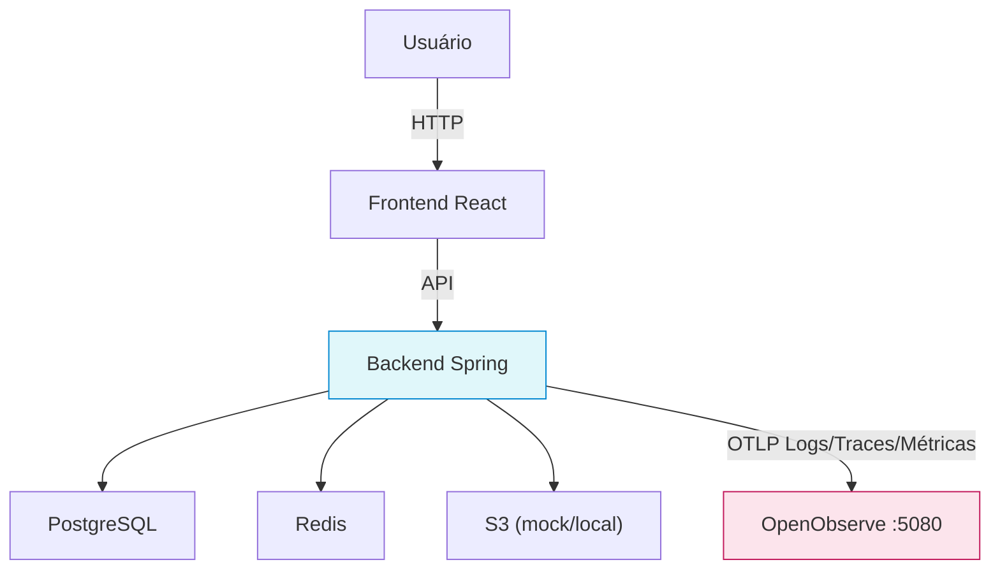
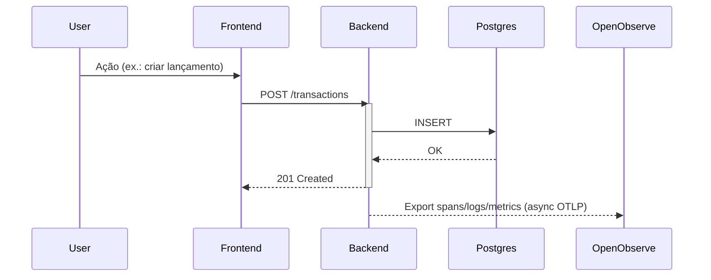

# Observabilidade - BC Finances

## Visão Geral

O BC Finances adota os 3 pilares da observabilidade (**logs, métricas e tracing**) com base na stack abaixo:

| Pilar | Tecnologia | Detalhes |
|-------|------------|----------|
| Logs | Logback + `opentelemetry-logback-appender` | Logs JSON enriquecidos com `traceId/spanId`, enviados via OTLP |
| Métricas | Micrometer + Spring Boot Actuator | `http.server.requests`, métricas JDBC e customizadas expostas via `/actuator/metrics` e exportadas pelo OTLP |
| Tracing | OpenTelemetry Auto-Instrumentation | Captura automática de controllers, JDBC e Redis (100% sampling) |
| Coletor/Storage | OpenObserve (Docker) | Recebe OTLP (HTTP/Protobuf + gzip) em `http://openobserve:5080` |

## Arquitetura



### Fluxo do Tracing



## Configuração

### Docker Compose
- O serviço `openobserve` é iniciado junto aos demais serviços (`docker-compose up -d`).
- Volumes persistidos: `openobserve_data`.

### Aplicação
- Arquivo `bc-finances-backend/src/main/resources/application.yml` define:
  - `management.tracing.enabled=true` e sampling `1.0`.
  - OTLP com `http/protobuf`, `gzip` e propagators `tracecontext` + `baggage`.

### Variáveis relevantes (`.env` / Docker)
- `OPENOBSERVE_USERNAME`, `OPENOBSERVE_PASSWORD`, `OPENOBSERVE_ORG`, `OPENOBSERVE_STREAM`.
- `OTEL_EXPORTER_OTLP_ENDPOINT` (padrão local `http://localhost:5080/api/default`).
- `OTEL_EXPORTER_OTLP_HEADER_AUTHORIZATION`:
  - Local: já populado com as credenciais padrões.
  - Produção: gerar token em **Settings › API Tokens** no OpenObserve e usar `Basic $(echo -n '<org_id>:<token>' | base64)`.

## Erros e Correlação

- `BcFinancesExceptionHandler` e `PersonExceptionHandler` retornam a seguinte estrutura:

```json
[
  {
    "msgUser": "Recurso não encontrado",
    "msgDev": "PersonNotFoundException: ...",
    "traceId": "c5738a7a83f34cbf8cc4b1e47eede91c",
    "spanId": "84a9c1bb8c6d2f04"
  }
]
```

- Com esses IDs é possível localizar rapidamente o trace no OpenObserve (`service.name=bc-finances-backend trace_id=<id>`).

## Endpoints Úteis

| Endpoint | Descrição |
|----------|-----------|
| `http://localhost:8080/actuator/health` | Health básico |
| `http://localhost:8080/actuator/metrics` | Catálogo de métricas Micrometer |
| `http://localhost:8080/actuator/prometheus` | Export Prometheus (caso habilitado) |
| `http://localhost:5080` | UI do OpenObserve |

## Boas Práticas

1. **Não utilize** credenciais padrão fora de ambientes locais. Gere tokens dedicados.
2. Para correlação manual, utilize `log.warn("traceId={}, spanId={}", traceId, spanId)` quando necessário (já disponíveis no MDC via `logging.pattern.correlation`).
3. Ajuste o `OTEL_SAMPLING_PROBABILITY` se o volume de spans/logs ficar muito alto em produção.

---
