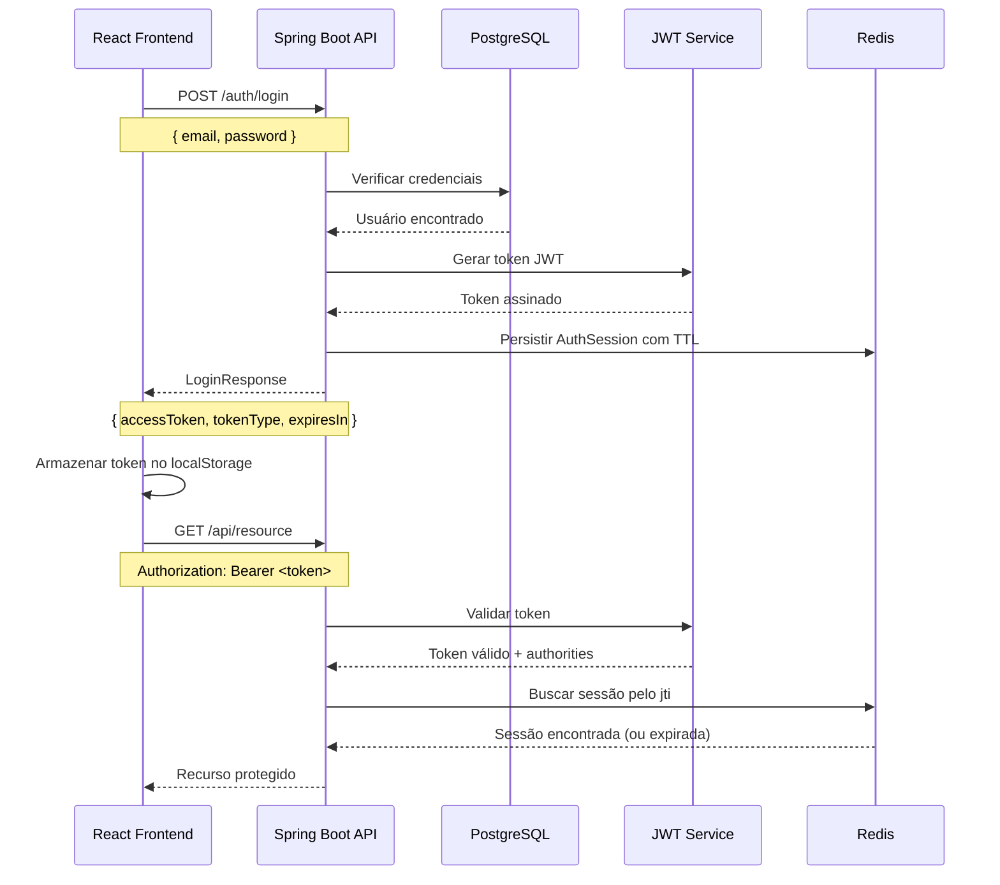

# Autenticação - BC Finances

## Visão Geral

O BC Finances utiliza um modelo híbrido de autenticação com **JWT (JSON Web Token)** validado pelo backend e **controle de sessão em Redis** para permitir revogação antecipada de tokens.

## Arquitetura JWT

### Características
- **JWT assinado**: Tokens possuem claims necessários e são assinados com RS256 (RSA + SHA-256)
- **Sessão cacheada**: Cada login gera uma sessão (`AuthSession`) persistida no Redis com o mesmo TTL do token
- **Expiração controlada**: Sessões e tokens expiram simultaneamente; sessões inválidas são removidas do cache
- **Revogação via logout**: O endpoint de logout remove a sessão do Redis e invalida o token associado

## Fluxo de Autenticação



## Implementação Backend

### Endpoint de Login

**URL**: `POST /auth/login`

**Request Body**:
```json
{
  "email": "admin@algamoney.com",
  "password": "admin"
}
```

**Response**:
```json
{
  "accessToken": "eyJ0eXAiOiJKV1QiLCJhbGciOiJSUzI1NiJ9...",
  "tokenType": "Bearer",
  "expiresIn": 3600000
}
```

### Configuração Spring Security

```java
@Configuration
@EnableWebSecurity
@EnableMethodSecurity
public class JwtSecurityConfig {
    
    @Bean
    public SecurityFilterChain filterChain(HttpSecurity http) throws Exception {
        return http
            .authorizeHttpRequests(auth -> auth
                .requestMatchers("/auth/login").permitAll()
                .anyRequest().authenticated()
            )
            .oauth2ResourceServer(oauth2 -> oauth2.jwt(withDefaults()))
            .sessionManagement(session -> 
                session.sessionCreationPolicy(SessionCreationPolicy.STATELESS)
            )
            .build();
    }
}
```

### Geração do Token JWT

```java
@Service
public class JwtService {
    
    public String generateToken(UserDetails userDetails) {
        return Jwt.withTokenValue("token")
            .header("alg", "RS256")
            .claim("sub", userDetails.getUsername())
            .claim("authorities", extractAuthorities(userDetails))
            .claim("iat", Instant.now())
            .claim("exp", Instant.now().plusSeconds(expirationTime))
            .build()
            .getTokenValue();
    }
}
```

## Implementação Frontend

### AuthService

```ts
// src/services/authService.ts
import { apiClient } from '@/services/apiClient'

export async function login(payload: { email: string; password: string }) {
  const { data } = await apiClient.post('/auth/login', payload)
  return data
}

export async function logout() {
  await apiClient.delete('/auth/logout')
}
```

### Proteção de Rotas e Contexto

```tsx
// src/hooks/useAuth.ts
import { useContext } from 'react'
import { AuthContext } from '@/contexts/AuthContext'

export const useAuth = () => useContext(AuthContext)
```

```tsx
// src/routes/PrivateRoute.tsx
import { Navigate, Outlet } from 'react-router-dom'
import { useAuth } from '@/hooks/useAuth'

export function PrivateRoute({ roles = [] }: { roles?: string[] }) {
  const { isAuthenticated, hasAnyPermission } = useAuth()

  if (!isAuthenticated) {
    return <Navigate to="/login" replace />
  }

  if (roles.length > 0 && !hasAnyPermission(roles)) {
    return <Navigate to="/not-authorized" replace />
  }

  return <Outlet />
}
```

## Interceptação HTTP

O token JWT é automaticamente incluído em todas as requisições Axios através do `apiClient`:

```ts
// src/services/apiClient.ts
apiClient.interceptors.request.use((config) => {
  const token = authStorage.getToken()
  if (token) {
    config.headers = config.headers ?? {}
    config.headers.Authorization = `Bearer ${token}`
  }
  return config
})

apiClient.interceptors.response.use(
  (response) => response,
  (error) => {
    if (error.response?.status === 401) {
      authStorage.clearToken()
      unauthorizedHandler?.()
    }
    return Promise.reject(error)
  },
)
```

## Logout

### Backend
- **Endpoint**: `DELETE /auth/logout`
- **Autenticação**: Obrigatória (token válido no header)
- **Comportamento**:
  1. Extrai o `jti` (ID do token) do JWT autenticado
  2. Remove a sessão correspondente do Redis
  3. Responde com `204 No Content`
  4. Se o token já estiver expirado ou a sessão não existir, o fluxo continua idempotente

### Frontend

- `AuthContext` remove tokens expirados automaticamente e registra um `unauthorizedHandler` para tratar respostas 401 sem interromper a experiência do usuário.

## Segurança

### Proteções Implementadas
- **HTTPS obrigatório** em produção
- **CORS configurado** para domínios específicos
- **Tokens com expiração** limitada
- **Validação de assinatura** RS256
- **localStorage seguro** (não cookies por simplicidade)

### Credenciais Padrão
- **Email**: admin@algamoney.com
- **Senha**: admin

## Troubleshooting

### Token inválido
- Verificar formato JWT (3 partes separadas por ponto)
- Validar expiração do token
- Confirmar assinatura RS256

### Erro 401
- Credenciais incorretas
- Token expirado
- Token malformado

### Erro 403
- Usuário sem permissão para o recurso
- Authority incorreta no token
