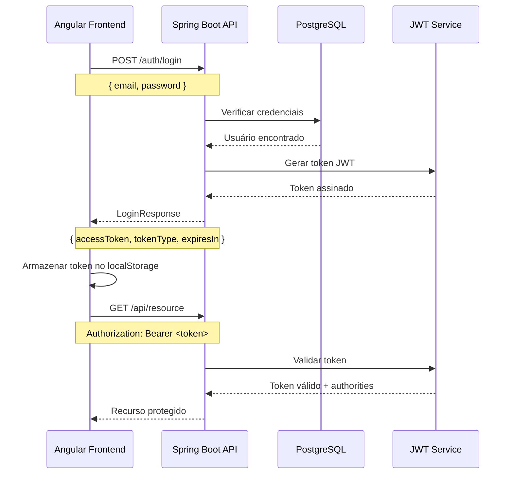

# Autenticação - BC Finances

## Visão Geral

O BC Finances utiliza **JWT (JSON Web Token) stateless** para autenticação de usuários.

## Arquitetura JWT

### Características
- **Stateless**: Servidor não mantém estado de sessão
- **Self-contained**: Token contém todas as informações necessárias
- **Seguro**: Assinado com RS256 (RSA + SHA-256)
- **Expiração**: Tokens têm tempo de vida limitado

## Fluxo de Autenticação



## Implementação Backend

### Endpoint de Login

**URL**: `POST /auth/login`

**Request Body**:
```json
{
  "email": "admin@algamoney.com",
  "password": "admin"
}
```

**Response**:
```json
{
  "accessToken": "eyJ0eXAiOiJKV1QiLCJhbGciOiJSUzI1NiJ9...",
  "tokenType": "Bearer",
  "expiresIn": 3600000
}
```

### Configuração Spring Security

```java
@Configuration
@EnableWebSecurity
@EnableMethodSecurity
public class JwtSecurityConfig {
    
    @Bean
    public SecurityFilterChain filterChain(HttpSecurity http) throws Exception {
        return http
            .authorizeHttpRequests(auth -> auth
                .requestMatchers("/auth/login").permitAll()
                .anyRequest().authenticated()
            )
            .oauth2ResourceServer(oauth2 -> oauth2.jwt(withDefaults()))
            .sessionManagement(session -> 
                session.sessionCreationPolicy(SessionCreationPolicy.STATELESS)
            )
            .build();
    }
}
```

### Geração do Token JWT

```java
@Service
public class JwtService {
    
    public String generateToken(UserDetails userDetails) {
        return Jwt.withTokenValue("token")
            .header("alg", "RS256")
            .claim("sub", userDetails.getUsername())
            .claim("authorities", extractAuthorities(userDetails))
            .claim("iat", Instant.now())
            .claim("exp", Instant.now().plusSeconds(expirationTime))
            .build()
            .getTokenValue();
    }
}
```

## Implementação Frontend

### AuthService

```typescript
@Injectable()
export class AuthService {
  
  login(email: string, password: string): Observable<any> {
    const body = { email, password };
    
    return this.httpClient.post(this.authLoginUrl, body, {headers})
      .pipe(
        tap((response: any) => this.storeToken(response.accessToken))
      );
  }
  
  private storeToken(token: string) {
    this.jwtPayload = this.jwtHelperService.decodeToken(token);
    localStorage.setItem(TOKEN_NAME, token);
  }
}
```

### AuthGuard

```typescript
@Injectable()
export class AuthGuard implements CanActivate {
  
  canActivate(route: ActivatedRouteSnapshot): boolean {
    if (this.auth.isAccessTokenInvalid()) {
      this.router.navigate(['/login']);
      return false;
    }
    
    if (route.data.roles && !this.auth.hasAnyPermission(route.data.roles)) {
      this.router.navigate(['/not-authorized']);
      return false;
    }
    
    return true;
  }
}
```

## Interceptação HTTP

O token JWT é automaticamente incluído em todas as requisições HTTP através do `JwtModule`:

```typescript
JwtModule.forRoot({
  config: {
    tokenGetter: () => localStorage.getItem('token'),
    allowedDomains: environment.tokenAllowedDomains,
    disallowedRoutes: environment.tokenDisallowedRoutes
  }
})
```

## Logout

O logout é **client-side** para arquitetura stateless:

```typescript
logout() {
  this.auth.clearAccessToken(); // Remove do localStorage
  return Promise.resolve();
}
```

## Configuração de Ambiente

### Development
```typescript
export const environment = {
  apiUrl: 'http://localhost:8080',
  tokenAllowedDomains: [new RegExp('localhost:8080')],
  tokenDisallowedRoutes: [new RegExp('/auth/login')]
};
```

### Production
```typescript
export const environment = {
  apiUrl: 'https://launchs-api.herokuapp.com',
  tokenAllowedDomains: [new RegExp('launchs-api.herokuapp.com')],
  tokenDisallowedRoutes: [new RegExp('/auth/login')]
};
```

## Segurança

### Proteções Implementadas
- **HTTPS obrigatório** em produção
- **CORS configurado** para domínios específicos
- **Tokens com expiração** limitada
- **Validação de assinatura** RS256
- **localStorage seguro** (não cookies por simplicidade)

### Credenciais Padrão
- **Email**: admin@algamoney.com
- **Senha**: admin

## Troubleshooting

### Token inválido
- Verificar formato JWT (3 partes separadas por ponto)
- Validar expiração do token
- Confirmar assinatura RS256

### Erro 401
- Credenciais incorretas
- Token expirado
- Token malformado

### Erro 403
- Usuário sem permissão para o recurso
- Authority incorreta no token