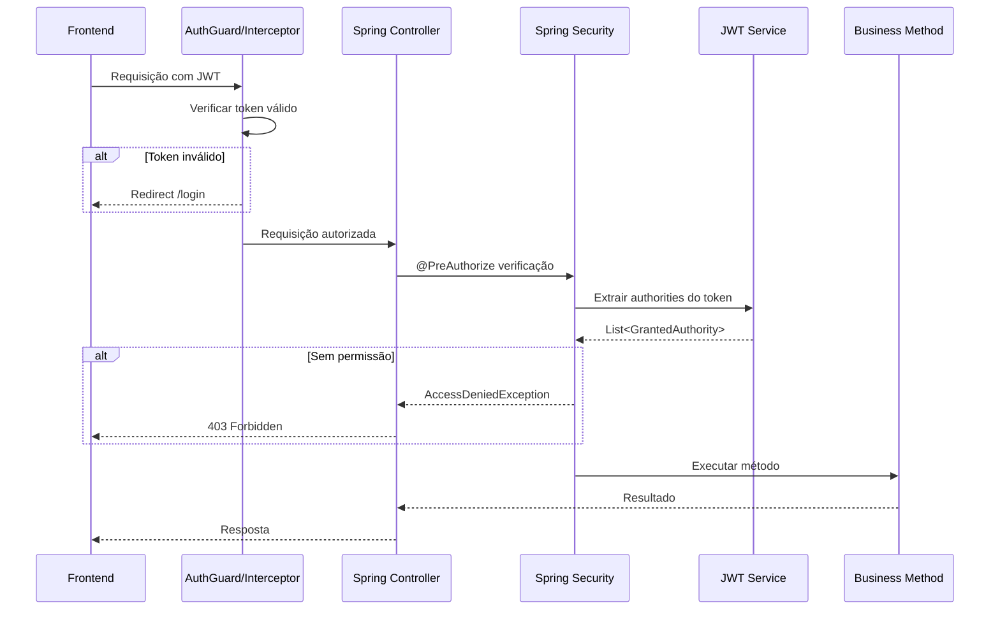

# Autorização - BC Finances

## Visão Geral

O sistema de autorização do BC Finances utiliza **Spring Security Method Security** com anotações `@PreAuthorize` e **authorities baseadas em roles** contidas no token JWT.

## Arquitetura de Autorização

### Modelo de Permissões
- **Role-based**: Cada usuário possui roles específicas
- **Method-level**: Controle fino de acesso por método
- **JWT authorities**: Permissões incluídas no token JWT
- **Stateless**: Não requer consulta ao banco para cada requisição

## Fluxo de Autorização



## Roles e Authorities

### Estrutura de Permissões

| Role | Authority | Descrição |
|------|-----------|-----------|
| Admin | `ROLE_SEARCH_CATEGORY` | Buscar categorias |
| Admin | `ROLE_CREATE_CATEGORY` | Criar categorias |
| Admin | `ROLE_SEARCH_PERSON` | Buscar pessoas |
| Admin | `ROLE_CREATE_PERSON` | Criar pessoas |
| Admin | `ROLE_SEARCH_TRANSACTION` | Buscar lançamentos |
| Admin | `ROLE_CREATE_TRANSACTION` | Criar lançamentos |
| Admin | `ROLE_REMOVE_TRANSACTION` | Remover lançamentos |

### Mapeamento no Banco

```sql
-- Usuários
INSERT INTO users (name, email, password) VALUES 
('Administrador', 'admin@algamoney.com', '$2a$10$...');

-- Permissões
INSERT INTO permissions (description) VALUES 
('ROLE_SEARCH_CATEGORY'),
('ROLE_CREATE_CATEGORY'),
('ROLE_SEARCH_PERSON'),
('ROLE_CREATE_PERSON'),
('ROLE_SEARCH_TRANSACTION'),
('ROLE_CREATE_TRANSACTION'),
('ROLE_REMOVE_TRANSACTION');

-- Associação usuário-permissões
INSERT INTO user_permissions (user_id, permission_id) VALUES 
(1, 1), (1, 2), (1, 3), (1, 4), (1, 5), (1, 6), (1, 7);
```

## Implementação Backend

### Configuração Method Security

```java
@Configuration
@EnableMethodSecurity(prePostEnabled = true)
public class JwtSecurityConfig {
    
    @Bean
    public JwtAuthenticationConverter jwtAuthenticationConverter() {
        JwtAuthenticationConverter converter = new JwtAuthenticationConverter();
        converter.setJwtGrantedAuthoritiesConverter(jwt -> {
            Collection<String> authorities = jwt.getClaimAsStringList("authorities");
            return authorities.stream()
                .map(SimpleGrantedAuthority::new)
                .collect(Collectors.toList());
        });
        return converter;
    }
}
```

### Anotações nos Controllers

```java
@RestController
@RequestMapping("/categories")
public class CategoryController {
    
    @GetMapping
    @PreAuthorize("hasAuthority('ROLE_SEARCH_CATEGORY')")
    public Page<Category> search(@RequestParam(required = false) String name, Pageable pageable) {
        return categoryService.search(name, pageable);
    }
    
    @PostMapping
    @PreAuthorize("hasAuthority('ROLE_CREATE_CATEGORY')")
    public ResponseEntity<Category> create(@Valid @RequestBody Category category) {
        Category savedCategory = categoryService.save(category);
        return ResponseEntity.status(HttpStatus.CREATED).body(savedCategory);
    }
}
```

```java
@RestController
@RequestMapping("/transactions")
public class TransactionController {
    
    @GetMapping
    @PreAuthorize("hasAuthority('ROLE_SEARCH_TRANSACTION')")
    public Page<Transaction> search(TransactionFilter filter, Pageable pageable) {
        return transactionService.search(filter, pageable);
    }
    
    @PostMapping
    @PreAuthorize("hasAuthority('ROLE_CREATE_TRANSACTION')")
    public ResponseEntity<Transaction> create(@Valid @RequestBody Transaction transaction) {
        Transaction savedTransaction = transactionService.save(transaction);
        return ResponseEntity.status(HttpStatus.CREATED).body(savedTransaction);
    }
    
    @DeleteMapping("/{id}")
    @PreAuthorize("hasAuthority('ROLE_REMOVE_TRANSACTION')")
    public ResponseEntity<Void> remove(@PathVariable Long id) {
        transactionService.delete(id);
        return ResponseEntity.noContent().build();
    }
}
```

### Geração de Authorities no JWT

```java
@Service
public class JwtService {
    
    private Collection<String> extractAuthorities(UserDetails userDetails) {
        return userDetails.getAuthorities().stream()
            .map(GrantedAuthority::getAuthority)
            .collect(Collectors.toList());
    }
    
    public String generateToken(UserDetails userDetails) {
        return Jwt.withTokenValue("token")
            .claim("authorities", extractAuthorities(userDetails))
            .build()
            .getTokenValue();
    }
}
```

## Implementação Frontend

### AuthService - Verificação de Permissões

```typescript
@Injectable()
export class AuthService {
  
  hasPermission(permission: string): boolean {
    return this.jwtPayload && this.jwtPayload.authorities.includes(permission);
  }
  
  hasAnyPermission(roles: string[]): boolean {
    return roles.some(role => this.hasPermission(role));
  }
}
```

### AuthGuard - Proteção de Rotas

```typescript
@Injectable()
export class AuthGuard implements CanActivate {
  
  canActivate(route: ActivatedRouteSnapshot): boolean {
    // Verificar se token é válido
    if (this.auth.isAccessTokenInvalid()) {
      this.router.navigate(['/login']);
      return false;
    }
    
    // Verificar permissões específicas da rota
    if (route.data.roles && !this.auth.hasAnyPermission(route.data.roles)) {
      this.router.navigate(['/not-authorized']);
      return false;
    }
    
    return true;
  }
}
```

### Configuração de Rotas

```typescript
const routes: Routes = [
  {
    path: 'categories',
    component: CategoriesComponent,
    canActivate: [AuthGuard],
    data: { roles: ['ROLE_SEARCH_CATEGORY'] }
  },
  {
    path: 'transactions',
    component: TransactionsComponent,
    canActivate: [AuthGuard],
    data: { roles: ['ROLE_SEARCH_TRANSACTION'] }
  }
];
```

### Condicionais no Template

```html
<!-- Exibir botão apenas se usuário tem permissão -->
<button *ngIf="auth.hasPermission('ROLE_CREATE_TRANSACTION')" 
        class="btn btn-primary"
        (click)="createTransaction()">
  Nova Transação
</button>

<!-- Menu condicional -->
<ul class="navbar-nav">
  <li *ngIf="auth.hasPermission('ROLE_SEARCH_CATEGORY')">
    <a routerLink="/categories">Categorias</a>
  </li>
  <li *ngIf="auth.hasPermission('ROLE_SEARCH_TRANSACTION')">
    <a routerLink="/transactions">Lançamentos</a>
  </li>
</ul>
```

## Estrutura do Token JWT

### Payload Exemplo
```json
{
  "sub": "admin@algamoney.com",
  "authorities": [
    "ROLE_SEARCH_CATEGORY",
    "ROLE_CREATE_CATEGORY",
    "ROLE_SEARCH_PERSON",
    "ROLE_CREATE_PERSON",
    "ROLE_SEARCH_TRANSACTION",
    "ROLE_CREATE_TRANSACTION",
    "ROLE_REMOVE_TRANSACTION"
  ],
  "iat": 1692792000,
  "exp": 1692795600
}
```

## Tratamento de Erros

### 403 Forbidden
```java
@ExceptionHandler(AccessDeniedException.class)
public ResponseEntity<ErrorResponse> handleAccessDenied(AccessDeniedException ex) {
    ErrorResponse error = new ErrorResponse(
        "ACCESS_DENIED",
        "Usuário não possui permissão para acessar este recurso"
    );
    return ResponseEntity.status(HttpStatus.FORBIDDEN).body(error);
}
```

### Frontend - Interceptor de Erros
```typescript
@Injectable()
export class HttpErrorInterceptor implements HttpInterceptor {
  
  intercept(req: HttpRequest<any>, next: HttpHandler): Observable<HttpEvent<any>> {
    return next.handle(req).pipe(
      catchError((error: HttpErrorResponse) => {
        if (error.status === 401) {
          this.router.navigate(['/login']);
        } else if (error.status === 403) {
          this.router.navigate(['/not-authorized']);
        }
        return throwError(error);
      })
    );
  }
}
```

## Boas Práticas

### Princípio do Menor Privilégio
- Usuários recebem apenas as permissões mínimas necessárias
- Verificação granular por método/recurso
- Separação clara entre roles de leitura e escrita

### Defensiva
- Validação no backend mesmo com controles frontend
- Fallback para "sem permissão" quando em dúvida
- Logs de tentativas de acesso negado

### Performance
- Authorities no JWT evitam consultas ao banco
- Cache de permissões no frontend via localStorage
- Validação stateless no backend